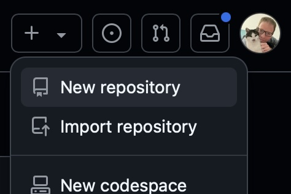
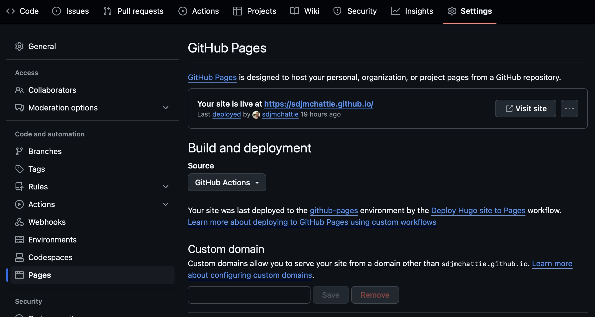

---
aliases:
  - build-a-site-with-hugo-and-host-for-free-on-github-pages
date: 2025-01-21
title: How I built my website and host it for free on GitHub Pages
description: In this tutorial, I will show you how I've used a tool called Hugo to build a static website from markdown contents and how the built site can be automatically deployed to GitHub Pages. In about half an hour, you too can have a website up and running without paying a penny.
slug: host-hugo-sites-for-free-in-github-pages
image: /images/posts/hugo-github-pages.jpg
tags:
  - Hugo
  - GitHub
  - Markdown
  - Web Development
---

There's that now old adage that if you're not online, you're no-one.
Perhaps that's a bit harsh when it comes to a personal presence on the world wide web, but it certainly applies to businesses.
In any case, I decided I wanted to get my own site up as it's about time I shared my experiences in the hope that they're useful to at least someone.
What better way to start my new blog than to tell you how I set it up.
Which tools did I use and why?
How do I get to host it for free?

## Which tools to use

You can use anything you want to create a website, but for most people, simplicity is key.
It's also important to choose something that can be hosted with static contents if you aim is to host it for free.
That's why I chose [Hugo](https://gohugo.io)!
Here are just a few of the reasons I choose this over other options:

- It's simple to get running on your machine.
- It's fast!
- It has loads of free themes to choose from.
- The content is all written as Markdown and Hugo does the rest.
- You can export all your content as a static site.

## Where to host for free

Free hosting of a whole site is kind of rare these days, but thankfully options still exist.
The one this blog post is going to focus on is GitHub Pages.
Every user on GitHub gets to host pages for their projects and one for their user.
Maybe you're not a developer, but you can still use this functionality.
You will need to use some Git commands though to push your contents up to the server.
I'll try to keep things as simple as possible.

## Step-by-step guide

Let's take it step-by-step.
If you find there's anything missing from here that you thought should be included, please [let me know]( "Contact Me") and I will aim to fix it.
I personally use macOS, so I apologise if you're using Windows and the instructions don't work on your computer.
Hopefully you can get the gist of what's going on or you can ask a techie friend for help.

### Installing Hugo

First of all, you need to get Hugo installed.
Thanksfully, [Hugo has instructions](https://gohugo.io/installation/) on how to do this on various operating systems.
In my case, I used [Homebrew](https://brew.sh) which I already had on my computer.
On a Mac, you should be able to open a terminal window by entering "Terminal" in a spotlight search (press Cmd + Space to access Spotlight).
Then to check for Homebrew, try the following command.

**Note:** you don't need to include the `$` at the start of a line; it is there to indicate that the terminal was waiting for your input on that line, referred to as the prompt.

```shell
$ brew --version
Homebrew 4.4.16
```

It doesn't matter if your version number is different from mine.

If Homebrew isn't installed, you need to copy the command from the Homebrew website and paste it into your Terminal application to get it installed.

Once Homebrew is installed, you can install Hugo using

```shell
brew install hugo
```

And that's it!

You can confirm it's installed by trying the following in the Terminal where you should be told the version that's installed.

```shell
$ hugo version
hugo v0.141.0+extended+withdeploy darwin/arm64 BuildDate=2025-01-16T13:11:18Z VendorInfo=brew
```

### Setting up your user's GitHub Pages

Hopefully you already have a [GitHub](https://github.com) account.
If not, sign up for one; they're free!
If you've not used Git before, you might find this tricky.
It's a big topic so I can't really cover it in this post.

To get a GitHub Pages entry for your user on GitHub, you need to create a new repository with a specific name.
To do this, go to the plus menu at the top of the GitHub site and choose "New repository" as shown.



The repository must be given a name matching the format `your-username.github.io`.
All other values can be left at their defaults.
After the repository is created, it doesn't contain any code yet, but that's OK because we're sorting that out soon.

### Prepare GitHub to build your site

Now that you have a repository for your user's GitHub Pages, we can prepare it to build your site from Hugo source code.
Go to the Settings tab for your new repository and choose the Pages page from the left menu.
It should look something like this.



Change the Source dropdown to GitHub Actions as shown.

### Prepare a new website

We need to make a new Hugo site using the Hugo application you installed earlier.
To do this, use your Terminal to navigate to a folder on your computer where you'd like to keep the source code for your website.
If you're not familiar with how to do this, you use the `cd` command to change directories until you get to where you need to be.
Then use the following command.

```shell
$ hugo new site my-website
Congratulations! Your new Hugo site was created in /Users/stuart/my-website.

Just a few more steps...

1. Change the current directory to /Users/stuart/my-website.
2. Create or install a theme:
   - Create a new theme with the command "hugo new theme <THEMENAME>"
   - Or, install a theme from https://themes.gohugo.io/
3. Edit hugo.toml, setting the "theme" property to the theme name.
4. Create new content with the command "hugo new content <SECTIONNAME>/<FILENAME>.<FORMAT>".
5. Start the embedded web server with the command "hugo server --buildDrafts".

See documentation at https://gohugo.io/.
```

Hugo is taken over my guide at this point!

So let's do what Hugo says, or at least some of it.
Follow all the steps except 4.
When you're doing step 2, choose to create a new theme for now and call it `my-website`.
You can switch to a pre-made theme after this is set up by looking for it on the Hugo website.
The default theme contains some content in the `content` directory.
Basically, think of themes as a base level of content and layouts etc for your site and then you put your real content outside your theme.

When you run `hugo server --buildDrafts`, a new site will be served on your local machine and you can access it by going to [http://localhost:1313](http://localhost:1313).
It won't look pretty just yet as we've not used a proper theme for this process and you should pick a theme you like and apply it by placing it in the `themes` folder then setting its name in the `hugo.toml` config file.

### Get GitHub hosting your new site

You've seen the site works on your machine, but how do we get it working on GitHub Pages?
First we need to attach your new site's directory to the repository on GitHub.
You can do this by making sure you're in the root directory of your new site's source code and issuing the following commands.
Be sure to use your actual GitHub username in the second command.

```shell
$ git init
Initialized empty Git repository in /Users/stuart/my-website/.git/

$ git remote add origin https://github.com/your_username/your_username.github.io.git
```

Now your site's source code is hooked up to GitHub and almost ready to be pushed.
Before we do push it though, we need to tell GitHub how it should build the pages to host.
We do that by defining a GitHub Actions workflow.
Create a directory alongside your website code called `.github` and inside that create a directory called `workflows`.
Add a new file to the `workflows` directory called `hugo.yaml` and put this contents into it.

```yaml
# Sample workflow for building and deploying a Hugo site to GitHub Pages
name: Deploy Hugo site to Pages

on:
    # Runs on pushes targeting the default branch
    push:
        branches:
            - main

    # Allows you to run this workflow manually from the Actions tab
    workflow_dispatch:

# Sets permissions of the GITHUB_TOKEN to allow deployment to GitHub Pages
permissions:
    contents: read
    pages: write
    id-token: write

# Allow only one concurrent deployment, skipping runs queued between the run in-progress and latest queued.
# However, do NOT cancel in-progress runs as we want to allow these production deployments to complete.
concurrency:
    group: "pages"
    cancel-in-progress: false

# Default to bash
defaults:
    run:
        shell: bash

jobs:
    # Build job
    build:
        runs-on: ubuntu-latest
        env:
            HUGO_VERSION: 0.141.0
        steps:
            - name: Install Hugo CLI
              run: |
                  wget -O ${{ runner.temp }}/hugo.deb https://github.com/gohugoio/hugo/releases/download/v${HUGO_VERSION}/hugo_extended_${HUGO_VERSION}_linux-amd64.deb \
                  && sudo dpkg -i ${{ runner.temp }}/hugo.deb
            - name: Install Dart Sass
              run: sudo snap install dart-sass
            - name: Checkout
              uses: actions/checkout@v4
              with:
                  submodules: recursive
                  fetch-depth: 0
            - name: Setup Pages
              id: pages
              uses: actions/configure-pages@v5
            - name: Install Node.js dependencies
              run: "[[ -f package-lock.json || -f npm-shrinkwrap.json ]] && npm ci || true"
            - name: Build with Hugo
              env:
                  HUGO_CACHEDIR: ${{ runner.temp }}/hugo_cache
                  HUGO_ENVIRONMENT: production
                  TZ: Europe/London
              run: |
                  hugo \
                    --gc \
                    --minify \
                    --baseURL "${{ steps.pages.outputs.base_url }}/"
            - name: Upload artifact
              uses: actions/upload-pages-artifact@v3
              with:
                  path: ./public

    # Deployment job
    deploy:
        environment:
            name: github-pages
            url: ${{ steps.deployment.outputs.page_url }}
        runs-on: ubuntu-latest
        needs: build
        steps:
            - name: Deploy to GitHub Pages
              id: deployment
              uses: actions/deploy-pages@v4
```

What that does is looks for changes on the `main` branch of the respository when you push changes up.
Then it gets a build server ready at GitHub and installs Hugo on it.
It uses Hugo to generate the website content and it packages up the content into an artifact.
The artifact is deployed to GitHub Pages.
All of this happens without you needing to press any additional buttons.

You're ready to push your site up!
You just need to add all the files to Git and push them using these commands:

```shell
git add .
git commit -m "Initial commit"
git push origin main
```

Assuming all went well, you can also now see your files on the GitHub webpage for your repository under the Code tab.
The action you defined will be running and, when it finishes, your website will be visible at [https://your_username.github.io](https://your_username.github.io).

## Wrapping up

So there you have it.
Your own little piece of the web.
There's obviously much more to do to get the site looking like you want, but that's for another day.
Things you might want to look into at this point:

- Which theme would you like and does it provide extra functionality you might find useful?
- How to add and organise your pages using Hugo.
- How to make a part of your Hugo site be your blog (usually by using a predefined section name like post).

If you want a reference for how you might want to lay out the files for your own site, be sure to check out the [repository for this site](https://github.com/sdjmchattie/sdjmchattie.github.io).
There you can see how I've chosen a theme and how I've configured the look of the site where I didn't want it to be quite the way the theme has as a default.
