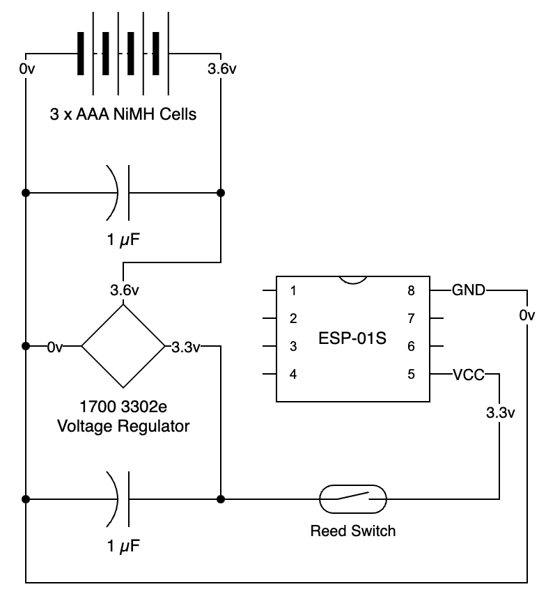
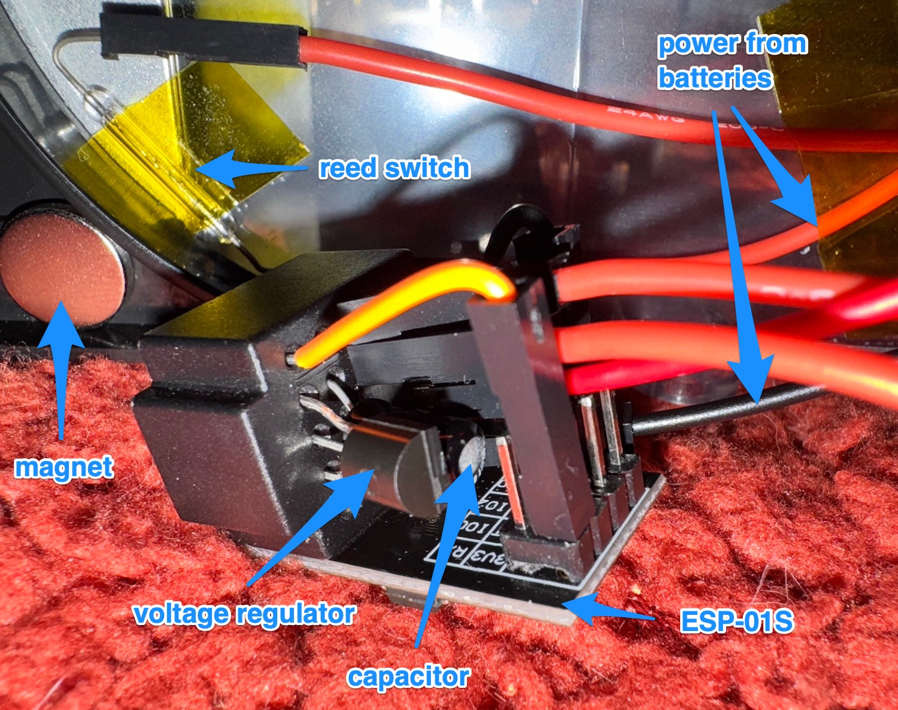

---
aliases:
  - /posts/making-my-humane-mouse-trap-notify-me-when-it-has-caught-a-mouse
date: 2025-02-15
title: Making a smart "Internet of Things" mouse trap
description: |-
  Humane mouse traps are great, but they do have the problem that if you don't notice they've caught something, they're not so humane any more.
  In this article, I explored a personal project to make the mouse trap smarter so it can notify me when a mouse has been caught.
slug: making-my-humane-mouse-trap-smart
image: /images/posts/smart-mouse-trap.jpg
tags:
  - Electronics
  - Microcontrollers
  - Personal Projects
---

Owning cats comes with its perks, but sometimes they bring home rodents and sometimes they let them go in your house!
We bought humane mouse traps to try to catch the mice that were left roaming the house.
These are actually surprisingly nice build quality, but they come with one big downside.
If you set them up somewhere you don't go often, like under the kitchen cabinets, how do you know when it's caught something?
It's not very humane to catch a mouse and then let it die of hunger and thirst because you find it a week or longer after it was caught.

In this article, I'm going to show you how I used a very basic microcontroller and a simple circuit to detect when the mouse trap has gone off.
The microcontroller will connect to my WiFi, connect to an MQTT broker and then publish a message to a topic.
The MQTT broker is subscribed to by Home Assistant which is then able to relay a notification to my phone every hour until the mouse trap is reset.

## What do you need for this build?

The list of items needed are as follows:

- A humane mouse trap that you can attach a magnet on the door
- A strong magnet
- A reed switch
- A microcontroller (I used an ESP-01S board, but it's easier with something more modern like an ESP32 C3 Mini)
- A voltage regulator and associated capacitors (unless your microcontroller has its own one built in)
- A power source (I used 3 x AAA NiMH rechargeable batteries in a holder)

## The circuit

The circuit for this build is a lot more complicated than it needed to be because I used an ESP-01S board.
These boards are really intended to be connected to other microcontrollers and use UART to pass AT messages in and out to get network access.
If that all sounds a bit complicated, it is!
Don't worry, you don't need to know about those things.
Just know that a microcontroller that regulates its own power supply and can connect to WiFi is a good place to start.
Then you can cut off all of the voltage regulation side of things and connect the batteries via the reed switch directly to the microcontroller.

When the reed switch is closed by a magnet, the circuit is complete and the microcontroller powers on.
Upon boot up, the microcontroller is programmed to connect to WiFi, find a specified MQTT broker, publish a single message to one of the topics and then go into deep sleep so as not to drain the batteries.

## The code

The code for the microcontroller is quite long considering how little it really does, but it is fairly simple to follow.
I've included all the code I used on this [GitHub Gist](https://gist.github.com/sdjmchattie/cb33a9a196ec428d351d6c41acd6353f) which is fully commented to help you follow along.

It basically follows the steps I outlined above and it's designed to be compiled and deployed using Arduino IDE.
Note that this uses the AdaFruit MQTT library which you'd have to include in your IDE before being able to compile this.
It also needs the ESP8266 board module to be installed, since the ESP-01S uses an ESP8266 controller.
If you're using a different type of microcontroller, you would need the board module for that to be installed.
Also don't forget to change the values in the first few lines of the file to match your own WiFi network and MQTT broker.

Once programmed, I was able to power up the ESP-01S with 3.3v and it was generating the correct message on my MQTT broker after a few seconds.

## The build

My mouse trap has a door that drops down on the end when the mouse activates a pressure pad inside the tunnel.
Fortunately, that door swings into an area where it was easy to attach a reed switch and the door has a nice recess where I was able to attach a magnet.
The photo below gives you an idea of how compact I was able to make this because of the ESP-01S being so small, but it's worth referring to the larger photo at the top of the article for some context on how the wiring is placed.

You can see that the magnet comes to rest just a few millimetres away from the reed switch.
This is essential as the reed switches do need a good field of magnetism around them to close the circuit.
The main unit is actually a mini-breadboard in my case with the capacitors and the voltage regulator inserted into its rails.
I was able to adhere the ESP-01S to the edge of the breadboard and then mount the breadboard on top of the mouse trap out of the way.
Finally, the batteries connect into the breadboard to power up the voltage regulator, which in turn powers up the microcontroller.

## What happens after MQTT has received the message?

It's a good question because I haven't spoken about MQTT very much in this article.
That is kind of intentional because there's only so much an article should contain.
But to summarise the rest of my setup, which I already had:

- I have a Raspberry Pi 3B running in my house 24/7 which deals with things like blocking adverts on my whole network using PiHole and connecting to smart devices, relaying them through Apple Home Kit using Home Assistant.
- Home Assistant responds to events on the network, and one mechanism for this is by having an MQTT broker, which I also run on the Raspberry Pi.
- Home Assistant subscribes to messages on topics of the MQTT broker when you add automations to its config that tell it to trigger when a particular topic receives a message.
- I have an automation set up for the topic the mouse trap microcontroller sends a message to and when it goes off, the script starts sending notifications to my mobile phone which is also registered to Home Assistant.
- Every time a notification is sent, the script pauses for an hour, then sends another message.
  I do a check each time this event happens to make sure it's not the middle of the night.
- When I've dealt with the mouse trap, I can stop the script running on Home Assistant and everything is back to normal.

## Wrapping Up

So today's article shows how I took a regular cheap mouse trap and turned it into a smart device to fit in with my existing setup.
Perhaps you have a different set up, or you disagree with some of the choices I made here?
If so, get in touch.
I love to discuss these sorts of things and I am still learning electronics so I won't be offended.

One thing I think I could have done better is to put the reed switch between the batteries and the voltage regulator instead of after it.
I don't think it's going to cause any troubles the way I have it, but there's a chance the voltage regulator could fail by being powered all the time without any load.
