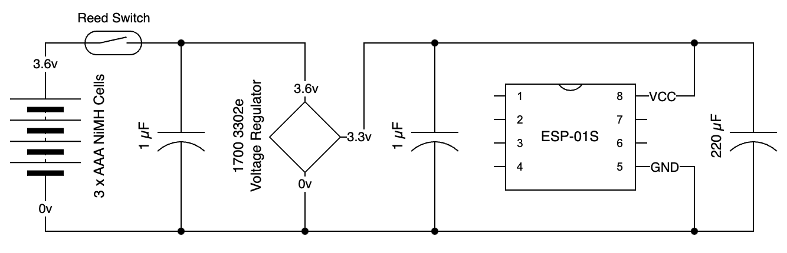
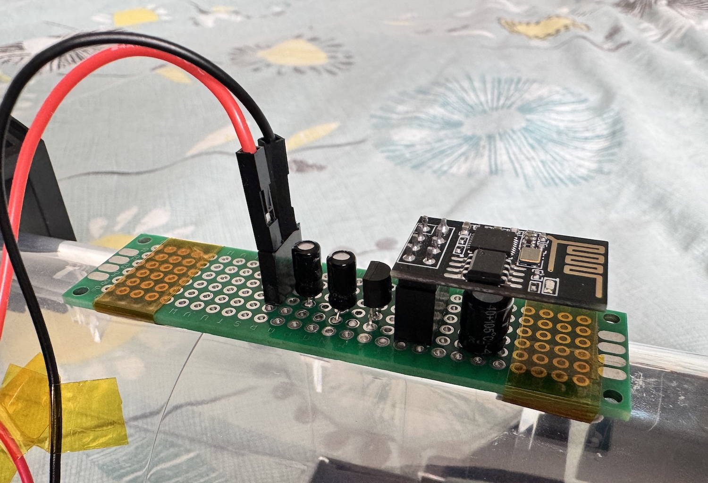
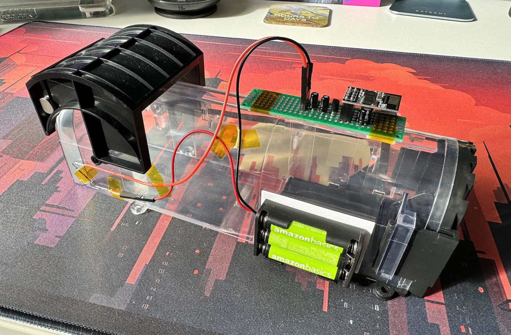

This is a follow-up for my [personal project on the humane mouse trap]() that notifies my phone via Home Assistant when the trap door is triggered.

I had feedback from fellow IoT enthusiasts that I could improve my design and I wanted to tidy up the circuitry a little.
It looking a bit temporary with so many wires sticking everywhere and the components are all just push fitted in my first iteration.
So here I switch to using some perf-board and make it look a bit more permanent.

## Updated circuit

The first thing I wanted to address was the circuit.
Overall I'm pretty happy with the circuit I had, but it was brought to my attention that the ESP-01S is stated in various locations online to be able to sometimes draw more than 250mA.
The reason this is a problem is that the 1700 3302e voltage regulator being used is only rated to provide 250mA.
If you try to draw more, the voltage regulator can fluctuate on and off to protect itself.



My fix is to add another capacitor near the power terminals of the ESP-01S with 220µF capacitance.
This acts like a mini-buffer for the ESP-01S.
After the power is supplied by the voltage regulator, the capacity soaks up the power offered until it is fully charged.
Then the ESP-01S comes on, and if it needs a burst of more than 250 mA, it can be supplied for a brief period by the capacitor.
I didn't see any problems before, but this gives some peace of mind that the circuit isn't going to fail when the power is turned on.

The other change I've made is to move the reed switch to be directly connected to the battery.
Again, this shouldn't make any major differences, but it does stop the voltage regulator from being continuously powered, and drawing a small current from the batteries.
The batteries are completely isolated until the trap door closes.

## Moving to a perf-board

The circuit was a bit too temporary for a product I plan to actually use.
The components were push fitted into a micro-breadboard, possibly only making a weak connection.
And the breadboard was overloaded with lots of components.
Besides, adding another capacitor means there wouldn't have been room for it on the existing breadboard.

So I switched to some perf-board instead.
This is sometimes referred to as proto-board as you can build a prototype circuit with it without getting properly etched circuit boards made.
This does involve the use of a soldering iron, but I'm happy to work with those and I have three in my collection:

- An old 240v no-name brand that has no temperature control.
- A Sequre SQ-001 soldering iron which is a TS100 clone that was popular when I bought it.
  I like it for its compact size and temperature adjustment, but it can be a bit weak when doing larger work.
- A Lidl Parkside Tools battery powered soldering iron.
  This has no temperature control, but a video by BigCliveDotCom shows you how to mod the iron with resistors to get the temperature you prefer to work at.

Basically I put some sockets on the perf-board for the ESP-01S to plug into and for the power leads.
Then I placed the legs of the components in at nearby locations and folded their legs under the perf-board to join components from the board together according to the circuit diagram.
This has produced a very nice finished board.



In addition to tidying up the circuit board, I was also able to use fewer long wires now that the reed switch connects directly to the positive terminal of the battery.
By using some carefully placed kapton tape, the wires are kept closer to the trap body, avoiding them getting caught in the door mechanism and also avoiding any rodents thinking they might be worth chewing on.



I'm very happy with this new result and will be putting the trap into service with some chocolate as bait.

## Home Assistant

I thought it would be good to give a bit more insight into how I set up Home Assistant for this project.
It's rather specific to my project, but it might be useful to people trying to do something similar.

### Helper devices

By going to Settings -> Devices & Services -> Helpers, you are able to set up pseudo-devices that can appear on a dashboard, but don't represent a physical device.
I created two helpers:

1. I set up a button called `Mouse Trap Notifications Off` with a rodent icon associated with it.
   Pressing this will deactivate the script talked about below via an automation.
1. I also set up a "Template binary sensor" called `Mouse Trap Notifications` which has a state template as follows:

   ```s
   {{ is_state('script.mouse_trap_notifications', 'on') }}
   ```

   This causes the state of the sensor to toggle whenever the script below is running or stopped.

Both of these helpers were added to my Overview dashboard so I can see whether the script is running and can press the button to turn it off when it is.

### Scripts

Under Settings -> Automations & Scenes -> Scripts, I set up a new script called `Mouse trap notifications`, again choosing the rodent icon for it.
The YAML for it is as shown:

```yaml
alias: Mouse trap notifications
sequence:
  - alias: Repeat notifications
    repeat:
      sequence:
        - alias: Notify if at a reasonable hour
          if:
            - condition: time
              after: "08:00:00"
              before: "22:00:00"
          then:
            - service: notify.notify
              metadata: {}
              data:
                title: Mouse Trap
                message: Mickey’s home!
              enabled: true
        - alias: Pause re-notification for 1 hour
          delay:
            hours: 1
            minutes: 0
            seconds: 0
            milliseconds: 0
      while:
        - condition: template
          value_template: "{{ true }}"
          alias: Infinite loop
mode: restart
icon: mdi:rodent
```

It has the following characteristics:

- If the script is triggered more than once, it `repeat`s which means it stops the previous iteration and starts running a new one.
- The `sequence` section is a while loop that uses `true` as a condition, setting up an infinite loop of the steps inside the sequence.
- First a check is done to see whether the time of day is between 08:00 and 22:00.
  If not, we don't do any notifications this hour.
- If it is between those two times, we trigger a notification to all devices logged into Home Assistant.
  This includes mobile phones, iPads, computers, etc.
  The notification has the title "Mouse Trap" and the message "Mickey's home!" which is the nickname we've given to mice we might catch.
- It them delays execution of the script for 1 hour until the loop goes back around, re-notifying everyone during the hours window.

### Automations

Under Settings -> Automations & Scenes -> Automations, I have set up two automations.
One to start the notifications, and one to stop them.

The start notifications automation has the following YAML:

```yaml
alias: Start Mouse Trap Notifications
description: ""
trigger:
  - platform: mqtt
    topic: MouseTrapTriggered
condition: []
action:
  - service: script.mouse_trap_notifications
    metadata: {}
    data: {}
    alias: Start the notifications script
mode: single
```

This listens for messages posted to the MQTT broker with the topic `MouseTrapTriggered`.
When a message like that comes in, it starts the script above, and nothing more.

The stop notifications automation has the following YAML:

```yaml
alias: Stop Mouse Trap Notifications
description: ""
trigger:
  - platform: state
    entity_id:
      - input_button.cancel_mouse_trap_notifications
condition: []
action:
  - service: script.turn_off
    target:
      entity_id: script.mouse_trap_notifications
    data: {}
mode: single
```

Very similar to the previous one, this listens for the button being pressed that we set up earlier.
When it is pressed, it stops the script, and nothing more.

## Wrapping Up

I hope this has been an interesting look at how my personal project has gone from a very early alpha to a more robust beta product.
Getting the circuit board tidied up and the wiring cleaner has been a rewarding process for me.

In addition I've now been able to describe what I've done with the Home Assistant side of things, since it's all working.
I think this is a clean solution to the problem and I also hope to move some rodents back outdoors if the cats bring them in!

If you have a similar project you've been working on or you want to discuss this one in more detail, please reach out to me.
I'm always ready to discuss things like this with like-minded people.
