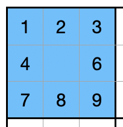

Sudoku is one of those puzzles that captivates anyone who attempts to solve it.
Sudoku puzzles can range from very easy to fiendishly difficult, despite the rules being relatively simple and unchanging.

To be valid, a Sudoku puzzle must have only a single solution — and this constraint actually becomes part of the logic required to solve some of the harder puzzles.
In other words, if you reach a point where the digits can be completed in more than one way without breaking the rules, the previous step was invalid.
The techniques used to solve them are well-documented and definitive, which means we can write code that follows those same techniques to find that unique solution.

So how do we solve this?
That's what this post is about!

If you like this post and you'd like to know more about how to plan and write Python software, check out the [Python]() tag.
You can also find the other posts in this series using the [Sudoku Series]() tag.

This post doesn't aim to explain how Sudoku works in detail, but we will cover some aspects of solving as we progress through the series.
To make the content accessible to everyone, here’s a quick overview of the basic rules:


- Every row in the grid must contain each of the digits 1 to 9 exactly once — green area.
- Every column in the grid must also contain the digits exactly once — yellow area.
- Every 3×3 block on the grid must also contain the digits exactly once — blue area.

The game starts with some values already placed, and your task is to fill in the remaining digits correctly.
The grid shown is for illustrative purposes only and does not represent a real puzzle.

With that out of the way, let’s get started!

## First Attempt at Solving

The simplest of puzzles can be solved simply by set comparisons and we can use this as the basis of our first attempt at a solver.
A very simple example would be a block where it already contains all but one digit.



In the example it should be clear that the cell with the missing digit must contain a 5.
This logic applies to rows and columns as well.

Perhaps filling in that 5 means a row now only has one missing digit, and so we can work our way around the grid, completing the missing digits until the whole grid is complete.

It's important to realise that this approach cannot solve very many Sudokus on its own,
but it is the most basic rule of Sudoku — and we have to start somewhere.

We will explore further approaches as the solution comes together.

## Choosing a User Interface

Before we write any code, it's worth thinking about how we're going to interact with the solver.

There are a few options to consider:

- A command-line interface, where we pass a puzzle as a file or string and see the result printed to the terminal.
- A simple text-based menu system that lets us choose a puzzle to solve, load a file, or display the result.
- A web interface, using something like Flask or Django, where we can input a puzzle in the browser and see the result rendered nicely.

For this first version, we'll keep it simple and go with a command-line interface.
It’s the easiest to build and test, and it keeps the focus on solving the puzzle rather than formatting output.

That said, we’ll structure the code in a way that makes it easy to swap in a different interface later.
If the solver is cleanly separated from the UI code, adding a web interface or GUI in the future will be much simpler.

## Input and Output Formats

Our solver will need a way to load puzzles and display solutions.
For now, we'll focus on text-based formats that are easy to read and write by hand or generate with scripts.

One option is to use a simple text file where each line represents a row in the puzzle, using a `.` to indicate empty cells.
For example, the grid shown in the introduction would be represented by the following text format:

```text
123.5....
456.8....
789.2....
....4....
231879654
....1....
....3....
....6....
....9....
```

This format is compact, easy to parse, and widely used in Sudoku data sets.

For output, we’ll display the puzzle as a neatly formatted grid, replacing the blanks with the solved values.
We can even reuse the same format as input, which makes it easy to compare before and after.
However for a more readable format, we can use spacing to our advantage:

```text
1 2 3   . 5 .   . . .
4 5 6   . 8 .   . . .
7 8 9   . 2 .   . . .

. . .   . 4 .   . . .
2 3 1   8 7 9   6 5 4
. . .   . 1 .   . . .

. . .   . 3 .   . . .
. . .   . 6 .   . . .
. . .   . 9 .   . . .
```

In future versions, we might want to support loading from CSV files or accepting puzzle input interactively from the user.
But for now, a simple text format will do the job.

## Object-Oriented Design

For our solver, an object-oriented approach will ensure things stay organised and scalable.

We’ll split the logic into three core classes: `Cell`, `Grid`, and `Solver`.

### Cell Class

Each `Cell` will represent a single square in the Sudoku grid. It will store:

- The current value of the cell (or `None` if it's empty).
- A list of valid candidates (possible numbers the cell can take, based on its row, column, and block).

The `Cell` class will have methods to:

- Set the value of the cell.
- Update the list of valid candidates when a digit is placed in the grid.

The `Grid` class will represent the entire Sudoku puzzle. It will contain:

- A 9x9 grid of `Cell` objects.
- Methods to retrieve rows, columns, and blocks, which will be useful for the solver.

The `Grid` class will also handle:

- Managing the state of the puzzle.
- Checking if the puzzle is solved.

### Solver Class

The `Solver` class will encapsulate the solving logic. It will be responsible for:

- Applying basic rules to solve the puzzle (like filling in cells with only one valid candidate).
- Iterating over the grid to apply logic until no more simple deductions can be made.

The `Solver` will be passed to the `Grid` class and used to update the state of the puzzle.
This separation keeps the grid management and solving logic distinct,
making the code more maintainable and allowing us to add new solving techniques later.

The solver may also have separate logic classes that apply one rule each, allowing us to separate concerns and make the solver more extensible.

### Input/Output Classes

In addition to the `Cell`, `Grid`, and `Solver` classes, we’ll also create separate classes to handle input and output.
This separation ensures that we can easily change how we load puzzles or display solutions, depending on the user interface we're working with.

## Testing the Solver

Testing is vital to ensure that our solver works as expected and to catch any potential bugs early on.

For this project, we'll use unit testing to validate the behavior of our `Cell`, `Grid`, and `Solver` classes.

### Test Cases

We’ll write tests for the following:

#### `Cell` class

- Ensure that a cell’s value can be set and retrieved correctly.
- Validate that the list of valid candidates updates properly when a value is assigned to the cell.

#### `Grid` class

- Test that the grid initializes correctly with all cells empty.
- Verify that retrieving rows, columns, and blocks works as expected.
- Check that the grid can detect if the puzzle is solved.

#### `Solver` class

- Test the basic solving logic (e.g., filling cells with only one valid candidate).
- Ensure that the solver stops when no further deductions can be made and that it doesn’t modify already filled cells.

### Testing Strategy

We'll start by writing tests for the individual methods in each class.
This will help us identify any issues with the basic functionality.
Once these tests pass, we can move on to integration tests,
which will verify how well the classes work together when solving a complete puzzle.

We can also write a few sample puzzles to test how the solver behaves with different difficulty levels. For example:

- A puzzle that can be solved with basic logic (our first attempt).
- A more difficult puzzle where more advanced techniques will eventually be needed.

### Running Tests

We'll use `pytest` for our testing framework because it’s simple to use and offers many useful features like automatic test discovery.

To run the tests, simply run the following command in the root directory:

```shell
pytest
```

This will automatically discover and run all the test functions in the project, ensuring that everything works as expected. If any tests fail, `pytest` will provide detailed output to help us pinpoint the issues.

We can also specify a particular test file or function to run, for example:

```shell
pytest test_solver.py
```

This will run only the tests in the `test_solver.py` file.

## Creating a Backlog

Here’s a list of the steps we need to take to build the Sudoku solver based on what we've planned:

1. **Set up the Development Environment**
   - Install Python and necessary dependencies.
   - Set up a version control system (e.g., Git).
   - Create a new Python project with a virtual environment.

1. **Write a basic command-line interface (CLI)**
   - Implement a simple CLI to load a Sudoku puzzle, display the grid, and interact with the solver.

1. **Create the in-memory model for the puzzle**
   - Implement the `Cell` and `Grid` classes to represent the puzzle.
   - Ensure the `Grid` can store a 9x9 grid of `Cell` objects.
   - Implement logic to track the state of the puzzle, i.e., filled cells and candidates for empty cells.
   - Implement logic that checks whether the completed grid meets the criteria for a valid solution.

1. **Parse input files into the model**
   - Write the functionality to load a Sudoku puzzle from a file and convert it into the in-memory `Grid` model.

1. **Write the solver and basic solving rule**
   - Implement the `Solver` class with a basic solving rule: fill cells that only have one valid candidate.
   - Ensure the solver updates the grid after each change and re-evaluates the grid.

1. **Write the output format to screen**
   - Implement a function to display the current state of the puzzle to the screen in a readable format.

1. **Handle unsolvable puzzles**
   - Add error handling for cases where the puzzle is unsolvable (e.g., no solution exists or the puzzle is invalid).
   - Provide meaningful error messages to the user when this happens.

1. **Implement unit testing**
   - Write unit tests for the `Cell`, `Grid`, and `Solver` classes to ensure they behave as expected.
   - Write tests for edge cases, such as invalid puzzles or incomplete inputs.

1. **Refine the solver for advanced techniques**
   - Once the basic solver is working, implement more advanced solving techniques to handle harder puzzles.
   - Continuously test and refine the solver as we add more rules.

## Wrap-Up

In this post, we've outlined the process of planning and building a Sudoku solver in Python.
We’ve discussed the structure of the application, the classes we'll need, and the initial logic to get us started.

Next, we’ll begin working through the backlog, starting with setting up the development environment and implementing the basic command line interface.
Stay tuned for future posts where we’ll walk through each step in more detail!

If you’re interested in following the progress of this project, be sure to check out the [Sudoku Series]() tag for future updates.
