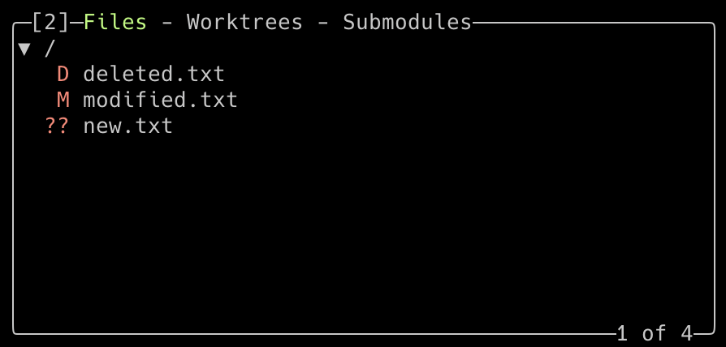
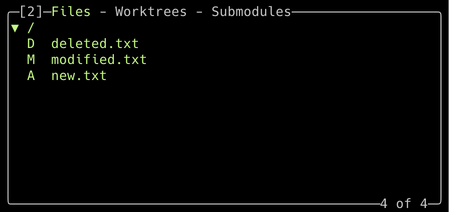

This is the third post in the Lazygit series.
You can see a list of all of the posts in this series by visiting the [Lazygit Series]() tag.
This week, we'll look at how to best use the files panel.

Lazygit’s files panel offers a useful view of the state of the files in your repository, including modifications, new files, and deletions.
From here you can select which changes you want to put into a commit and then push that commit.
We cover this and more in this post.

---

## The Three Tabs in the Files Panel

The Files panel in Lazygit is actually divided into three tabs, accessible by pressing the number `2` key to enter the panel and then switching between the tabs with the `[` and `]` keys:

### The Files Tab

This tab lists all the files in your repository that have been changed but not yet committed.
It clearly shows the status of each file, such as modified, new, or deleted, with visual markers.
From here, you can stage and unstage files and interact with their changes directly.

### The Worktrees Tab

The Worktrees tab allows you to manage multiple Git worktrees — essentially having multiple branches checked out simultaneously in separate directories.
This feature is useful when you want to work on several branches without constantly switching branches in a single workspace.

### The Submodules Tab

The Submodules tab displays the Git submodules configured in your repository.
Submodules are entire repositories checked out inside your main project’s folder, useful for managing dependencies or related projects.
From this tab, you can initialise, update, or enter submodules as needed.

---

## Staging Changed Files

When you open the Files tab, you’ll see a list of modified files, each accompanied by status markers indicating their state:

- Unstaged files are shown in red.
- Staged files are shown in green.
- `D` marks a deleted file.
- `M` marks a modified file.
- `?` marks a new untracked file.
- `A` marks a new staged file.

The following screenshots illustrate the appearance of deleted, modified, and new files before and after staging:

To stage or unstage a file, simply select the file using the arrow keys and press the space bar.
This toggles the staged status of the selected file.

When you press space on a directory name, it will stage or unstage all the files inside that directory.
If you want to stage all files at once, press `a` to toggle the staged status of all files in the list.

---

### Staging Individual Lines

Sometimes, you only need to stage specific changes within a file rather than the entire file.
Lazygit makes this easy by allowing you to stage individual lines.

To do this:

1. Select the file you want to work with and press `Enter` to open the file’s diff view.
2. Use the arrow keys or `j`/`k` to move between lines of code.
3. Press the space bar on a line to stage or unstage that individual line.
4. Navigate between separate hunks (groups of changes) with the left and right arrow keys.
5. You can also select a range of lines by pressing `v` and moving up or down, then pressing space to stage or unstage them.

This granular control is particularly handy when you want to split your commits or stage just part of your work.

---

## Completing A Commit

Once you have staged the files or individual lines you want to include, you can proceed to commit your changes.

In the Files panel, press `c` to open the commit message window.
Here, you can type your commit message in a simple dialog interface.
When you’re finished, press `Enter` to complete the commit.

Your new commit will then appear in the Commits panel (press `4` to switch to it and view history).

---

## Pushing Your Changes

After committing, you may want to push your changes to the remote repository.

From any panel, including the Files panel, press `P` to push your current branch to its remote counterpart.
Be sure to use the uppercase character to push — lowercase `p` is used for pulling changes in.

Lazygit will show you the progress and any errors in the interface, saving you from typing out the git push command manually.

---

## Other Keyboard Shortcuts

For a full list of other shortcuts relevant to the current panel, press `?` while in Lazygit to display the help menu.
This context-sensitive help is an invaluable resource when you’re getting started or exploring new features.

---

## Wrapping Up

In this post, we explored the Files panel of Lazygit — a central hub for viewing file changes, staging files or specific lines, and committing your work.
We touched on the visual markers that indicate file status and showed you the key shortcuts to stage, commit, and push with ease.
Additionally, we briefly introduced the Worktrees and Submodules tabs, which add powerful Git features for managing multiple work contexts and nested repositories.

Try out these features next time you’re managing a Git repository and experience how Lazygit speeds up your workflow without needing to remember complex commands.

Look out for the next post in this series, where we will explore Lazygit’s branches panel — a tool for separating your work on different features of your application.
