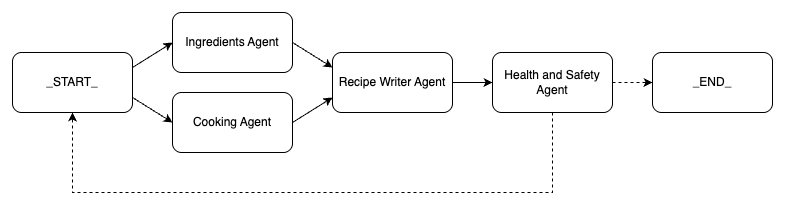

Agentic AI represents a generational leap forward in how artificial intelligence systems operate, moving beyond single, monolithic models to autonomous, goal-oriented agents.

If you missed it, my previous article on [how LLMs work under the hood]() lays the foundation for how large language models (LLMs) produce the content they do.

In this post, we will look at some of the downsides of LLMs and how they can be mitigated by using an agentic approach.
We'll explore what agentic AI is, why you might choose to build an agentic system rather than rely on a single LLM, and introduce some of the popular frameworks that can help you get started with agentic AI.

---

## What Is Agentic AI?

Agentic AI refers to AI systems designed to act autonomously — that is, they can make decisions, plan, execute tasks, and adapt without requiring constant human intervention.

Unlike a single LLM instance that generates responses based on an input prompt in isolation, agentic AI combines multiple specialised components (or "agents") each handling a portion of the workflow.

These agents can interact with data, call external tools or APIs, validate results, reflect on their outputs, and plan subsequent steps towards achieving a given goal.

---

## Why Use Agentic AI Instead of a Single LLM?

You might wonder why not just build everything on one large language model.

While single LLMs are powerful, they have some downsides that agentic AI helps to address:

- **Complex tasks get unwieldy**: Trying to solve multi-step workflows or long, complicated problems in one pass usually results in errors or incomplete answers.

- **Lack of modularity**: A single model doing everything means all logic is tangled together, making it hard to maintain or improve parts independently.

- **Cost inefficiency**: Large models are expensive to run. Agentic systems can assign simpler or repetitive tasks to cheaper models, reserving the expensive ones for core reasoning.

- **Limited error handling**: If a model’s output is incorrect, single-step LLMs rarely have built-in ways to validate and correct themselves.

Agentic AI introduces key patterns to overcome these challenges — splitting workflows into sub-tasks, validating and reflecting on outputs, involving humans in the loop where necessary, and orchestrating the sequence of actions dynamically.

---

## Common Patterns in Agentic AI

Agentic AI often employs design patterns that help build effective and flexible systems:

- **Separation of Concerns**
  Agents specialise in one aspect of the problem at a time, such as data retrieval, reasoning, or response formatting, reducing confusion and error.

- **Validation and Reflection**
  Agents can check the outputs of previous agents and revisit prior steps if results do not meet quality criteria, improving reliability.

- **Human-in-the-Loop**
  The system can pause for human input when appropriate, using that feedback to revise earlier outputs or decisions.

- **Cost-Efficient Model Usage**
  By using smaller, cheaper models for straightforward tasks and more powerful models for difficult reasoning, overall resource use is optimised.

- **Supervisor Pattern**
  Instead of hard-coding workflows, the system uses a supervisor agent which plans and controls the order of operations dynamically, calling upon other agents to do tasks until the work is complete.
  The supervisor assesses whether the specified task is complete, eventually choosing when to provide the final output from the process.

---

## Example Applications of Agentic AI

Agentic AI is well-suited to tasks involving complex workflows or continual decision-making:

- **Enterprise IT Support**
  An AI agent handles requests like VPN access by assessing roles, checking security policies, planning approvals, and revising based on feedback.

- **Customer Service Bots**
  Agents work together to interpret queries, access databases, validate answers, and decide when to escalate to humans.

- **Marketing Campaign Management**
  Systems autonomously monitor campaign performance, adjust strategies, and optimise budgets with minimal supervision.

- **Financial Trading Agents**
  Agents analyse market data, manage trades, ensure regulatory compliance, and learn from results to improve over time.

---

## Popular Frameworks to Build Agentic AI Systems

Several frameworks are helping developers build agentic AI solutions more easily and robustly:

- **LangChain**
  A popular framework for chaining LLM calls and tool usage, supporting complex workflows, reflection, and multi-agent coordination.
  See the [LangChain documentation](https://python.langchain.com/docs/introduction/) for more.

- **Microsoft AutoGen and Semantic Kernel**
  Integrated offerings for creating scalable, collaborative AI agents with advanced reasoning and dynamic adaptation.
  See the [AutoGen website](https://microsoft.github.io/autogen/stable/) for more.

- **CrewAI**
  An open-source multi-agent system designed to enable AI agents to collaborate on tasks through defined roles and shared goals.
  This framework is particularly well-suited to beginners, as it allows you to define agent roles in simple English without needing to worry much about how the agents interact behind the scenes.
  See the [CrewAI documentation](https://docs.crewai.com/en/introduction) for more.

- **LlamaIndex**
  Focuses on data orchestration, helping build agentic systems that integrate generative AI with external knowledge sources.
  See the [LlamaIndex documentation](https://docs.llamaindex.ai/en/stable/) for more.

- **LangGraph**
  A newer platform emphasising visual flow engineering of AI workflows, enabling custom agentic architectures and supervisor patterns.
  See the [LangGraph documentation](https://langchain-ai.github.io/langgraph/concepts/why-langgraph/) for more.

Choosing the right framework depends on your specific needs, the complexity of your workflows, and how much control you want over the AI agents' behaviour.
You can also use these frameworks alongside each other in the same system for particularly complicated goals, or where different frameworks offer strengths in multiple desirable areas.

---

## An Example Agentic Workflow

This article has talked in general terms until now, but I'm a big believer that examples are a great way to explain a concept.
So with that in mind, let's look at an example of a system that might have been built in LangGraph.
In the example, we define a system of agents that generate a recipe from a simple description.

- Given the request for a recipe, the system immediately produces both a list of ingredients and a list of steps that would be used to cook the intended recipe.
- After these are created, an agent is responsible for bringing all the information together into a coherent recipe.
  This agent would know how to format a recipe appropriately and would not need to do the work of the previous two agents.
- Once a recipe is ready, a health and safety agent would review the recipe and ensure it only suggests safe ingredients and that the recipe matches the original request.
  - If the recipe does not pass the validation steps, the graph goes back to the start and begins generating the recipe again.
    The earlier nodes retain their original output and can incorporate feedback from the health and safety agent to improve their response.
  - Of course, if the recipe is valid, it will move to the end of the graph and would be released to the user.

Hopefully this example gives you a clearer picture of how an agentic AI system can be designed in practice.

---

## Wrapping Up

Agentic AI unlocks the potential to build autonomous, adaptable, and cost-efficient AI applications far beyond what a single LLM instance can achieve.

By decomposing tasks, validating outputs, leveraging human input, and orchestrating agents dynamically, these systems address real-world challenges effectively.

If you want to explore how to use agentic AI in practice, stay tuned for our upcoming article on building first drafts of blog articles using LangGraph.

Meanwhile, if you haven’t already, I recommend reviewing our foundational post on [how LLMs work under the hood]() to get up to speed with the basics before diving deeper into agentic AI.
