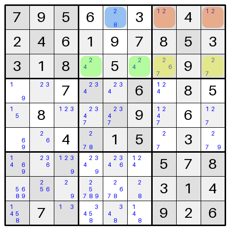
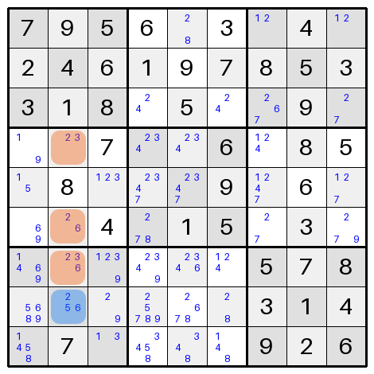

In the last [Sudoku Series blog post]() we implemented the single candidate rule.
In this post, we will look at implementing both the naked pair rule and the naked triple rule.
These are documented alongside more advanced rules on a [Mastering Sudoku website](https://masteringsudoku.com/sudoku-solving-techniques/).

If you like this post and you'd like to know more about how to plan and write Python software, check out the [Python]() tag.
You can also find other posts in the [Sudoku Series]().

---

## What are the Naked Set Rules?

These rules use logical deduction to try to identify cells that meet a number of criteria:

- The cells are in the same block, row, or column.
- The unique candidates among them are equal to the number of cells identified.

These form a naked set and, among those cells, all the candidate numbers must exist.
Therefore other cells in the same region can no longer contain those candidates.
This is easier to explain with images and specific examples of what we're looking for.

### Naked Pairs

A naked pair is the simplest of these sets.
This occurs when exactly two cells in the same block, row, or column meet the following two criteria:

- They both contain only two candidates.
- The candidates are the same in both cells.

Because these cells must, between them, contain those two values, any others that are neighbours of both cells cannot contain those candidates.

Consider the state of the board when we had only partly solved the Easy puzzle in the previous post.



In the top row, there are two orange cells which contain the candidates 1 and 2 only.
Therefore those two cells must contain the 1 and the 2 for this row and the blue cell cannot.
Removing the 2 from the blue cell leaves it with just 8 as a candidate.

Similarly, in row 3 there are two green cells with 2 and 4 as the only candidates.
Therefore none of the yellow cells can contain a 2 or a 4.
Removing those candidates reduces one of the yellow cells to a single candidate of 7.

### Naked Triples

A naked triple is really just an extension of the naked pair.
In this case you're looking for three cells in a block, row, or column that share the same three candidates.
Let's once again consider the same partly solved grid.



In this case, the three orange cells in the second column all contain combinations of the candidates 2, 3, and 6.
Note that they don't all have to contain all of the candidates, as long as none of them contain any additional candidates.
Because 2, 3, and 6 must exist among these three cells, that means the blue cell cannot contain any of those candidates and it is reduced to the single candidate of 5.

### What about Naked Singles?

Let's recall what we were doing the other week.
In the single candidate rule, we were finding a cell with a single candidate, setting its value to the candidate and removing the candidate from all neighbouring cells.
That last part is effectively what we're doing with the naked pair and naked triple rules above, just with one cell instead of a set of two or three.
The only difference is that with a naked pair or a naked triple, we still don't know which of the two or three candidates go in which specific cell yet.

---

## Implementing These Rules

The current code at the time of writing can be found [on GitHub](https://github.com/sdjmchattie/sudoku-solver/tree/blog/2025-08-16) where you can also see the [pull request](https://github.com/sdjmchattie/sudoku-solver/pull/2/files) for the changes in this post.

In order to implement these rules, it was necessary to be able to iterate over each of the blocks, columns, and rows in the grid.
As such, I've added a `region_iter()` method on the `Grid` class which yields all 27 possible regions in the grid, one at a time.

```python
for i in range(9):
    yield self.get_row_cells(i)
    yield self.get_column_cells(i)

for i in range(3):
    for j in range(3):
        yield self.get_block_cells(Point(i, j))
```

By `yield`ing instead of returning a list, the method automatically returns an iterator which can be used in a number of contexts in Python to go over the items one at a time.

### Naked Sets Implementation

I knew that the naked pairs and the naked triples would require fairly similar implementations, so I decided to extract a common method that can find naked sets of candidates in any quantity in the region.
This allows us to implement the naked pairs and the naked triples method in a single line each.

```python
def apply_naked_pairs_rule(grid: Grid) -> bool:
    return _apply_naked_set_rule(grid, size=2)

def apply_naked_triples_rule(grid: Grid) -> bool:
    return _apply_naked_set_rule(grid, size=3)
```

The method these two are calling does a number of things to find and apply the naked set rule.

### Finding Sets in each Region

```python
for region in grid.region_iter():
    incomplete_cells = [cell for cell in region if cell.value is None]
    naked_sets = [
        cells
        for cells in combinations(incomplete_cells, size)
        if len(set().union(*(cell.candidates for cell in cells))) == size
    ]
```

First we use our new region iteration method to look at blocks, columns, and rows separately.
Among the 9 cells within the region, we reduce those we are considering down to those that don't have a value yet.
Then we iterate over combinations of those cells, using `combinations` from the `itertools` package.
This considers every combination of items from a list that meet the specified size.
This in turn allows us to check every possible combination of cells in a region to see if they form a naked pair (combinations of 2 cells) or a naked triple (combinations of 3 cells).

For example:

```python
print(list(combinations([1, 2, 3, 4], 2)))
[(1, 2), (1, 3), (1, 4), (2, 3), (2, 4), (3, 4)]
```

If the cells in the combination contain, among them, only the exact number of unique candidates that we're looking for, the cells are added to our list of naked sets.

So if we're looking for naked triples (`size=3`) and we find three cells in the region that contain the candidates `[2, 5, 7]`, `[2, 7]`, and `[2, 5]` these would be a naked triple, and the tuple containing those cells would be in our list.

### Removing Candidates from other Cells

```python
for naked_set in naked_sets:
    candidates_to_remove = set().union(*(cell.candidates for cell in naked_set))
    for cell in region:
        if (
            cell in naked_set
            or cell.value is not None
            or cell.candidates.isdisjoint(candidates_to_remove)
        ):
            continue

        cell.candidates -= candidates_to_remove
        applied = True
```

Now that we've discovered combinations of cells that meet our requirements, we can use their candidates to remove them from other cells in the region.
While iterating over the cells in the region, we want to skip over any cells that either:

- Are part of the cells containing a naked set of candidates.
- Already have a value set on them and therefore do not have candidates.
- Do not contain any candidates that are part of the naked set.

For those that are left, we remove the candidates from them and update our flag to indicate that the rule was applied to something in the grid.
Returning a `True` value from the function will indicate to the caller that this rule changed something in our puzzle, just like we did for the single candidate rule.

---

## Applying All Our Rules

Now that we have two new methods to use as part of solving, it was time to update how we call the solver methods.

```python
# Apply rules, stopping after the first successful application.
# This ensures we always apply the simplest rules first.
# This can help with efficiency where complex rules take more CPU cycles to apply.
applied = (
    apply_single_candidate_rule(self.grid)
    or apply_naked_pairs_rule(self.grid)
    or apply_naked_triples_rule(self.grid)
)
```

This is a variation on my original plan to use the or-and-assign (`|=`) operator I was planning to use before.
The reason for this is that I don't want more complicated rules to apply before simpler ones if the simpler ones are still applicable.
If the single candidate rule is applied once to the grid, and that opens up more single candidates, I want to deal with those first.

This is partly because later rules might assume simpler solving has already been applied, but also because simpler rules, if applicable, use fewer resources, so our solver can remain quick.

---

## Testing Our Code

Unit tests have been added to confirm that our new rules behave the way we expect.
In the unit tests I check:

- Both new rules work on blocks, by setting up a grid which contains exactly one instance of a naked pair or naked triple and seeing that the candidates are updated as they should be.
- Both new rules work on columns.
- Both new rules work on rows.
- The new rules return True when they are able to apply.
- The new rules return False when they cannot apply.

I also update and add tests to the `Grid` and the `Solver` where I've updated the code, including checking that later rules do not get applied until earlier rules have already been applied as much as possible.

---

## Solving Puzzles

The moment of truth has come.
Running our solver on the easy puzzles it was not able to solve before now results in a completed puzzle.
Much to my amazement, the intermediate puzzles are also solvable with just these new rules as well.
I had assumed they would require more advanced techniques, but apparently not.

The puzzles labelled expert still do not solve though.
They get a lot further along, but are still hitting a dead end before being solved.
We will need more advanced rules for those!

---

## Wrapping up

So we've now got the ability to solve naked pairs and naked triples in puzzles.
For a lot of puzzles you might find in newspapers, this may be all that's needed.
But there is still one more simple rule set to apply before we get onto anything more complicated — the hidden pair and hidden triple.

Like the naked pair and naked triple we've worked on here, the hidden pair and hidden triple are effectively the same rule applied with different scope.
We'll talk about it more when the next post comes out about it and see how we can implement it in our solver.
Until then, I hope you're enjoying the series and please feel free to message me if you're building your own solver — I'd love to hear about it.
