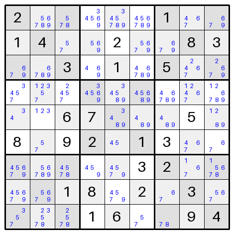
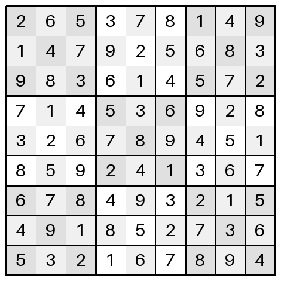

Up until now in the [Sudoku Series]() we've implemented a number of rules for Sudoku solving.
I had been trying to remember the name of an old iPhone Sudoku app I used to enjoy.
The reason I wanted to find it was that it used to be good at reviewing a puzzle and telling you what the next logical technique should be.

I finally found the app — [Enjoy Sudoku](http://www.enjoysudoku.com).
Sadly, it no longer appears to be available, but the web version does mention the source of the solving techniques, which we can use as a reference while building our Sudoku solver — [Sudopedia](https://www.sudopedia.org).
The following rules have been implemented from Sudopedia's solving techniques library:

- The single candidate rule, also known as a [Naked Single](https://www.sudopedia.org/wiki/Naked_Single).
- A rule for naked sets, including [Naked Pairs](https://www.sudopedia.org/wiki/Naked_Pair) and [Naked Triples](https://www.sudopedia.org/wiki/Naked_Triple).
- A rule for hidden sets, including [Hidden Singles](https://www.sudopedia.org/wiki/Hidden_Single), [Hidden Pairs](https://www.sudopedia.org/wiki/Hidden_Pair), and  [Hidden Triples](https://www.sudopedia.org/wiki/Hidden_Triple).

There are also [Naked Quads](https://www.sudopedia.org/wiki/Naked_Quad) and [Hidden Quads](https://www.sudopedia.org/wiki/Hidden_Quad) that we haven't implemented, but they would be easy to add.
The focus of this post is to implement a new rule for [Locked Candidates](https://www.sudopedia.org/wiki/Locked_Candidates), so let's get stuck in.

If you like this post and you'd like to know more about how to plan and write Python software, check out the [Python]() tag.

---

## What is the Locked Candidates Rule?

Locked candidates are present where a block and a row or column intersect.
In the intersection of three cells, locked candidates exist if:

- Digits among the candidates do not exist as candidates elsewhere in the block; or
- Digits among the candidates do not exist as candidates elsewhere in the row or column.

The type of locked candidates depends on which condition is met.

### Type 1 Locked Candidates

When the candidates in the intersection do not exist elsewhere in their block, they are type 1 locked candidates.
An example of this is shown below.

```text
.-----------.-----------.-----------.
|           |           |  ~  ~  ~  |
|  *  *  *  |  *  *  *  |  X  X  X  |
|           |           |  ~  ~  ~  |
'-----------'-----------'-----------'
```

Here `X` illustrates the cells in the intersection, `~` are cells in the rest of the block, and `*` are the cells in the rest of the row.
If any candidate value among the `X` cells does not exist in any of the `~` cells, those candidates are type 1 locked candidates.
In this case, those values must appear in the intersection and so they can be removed as options from the rest of the cells in the row, the `*` cells.

This can also be applied to a column instead of a row, as shown below.

```text
.-----------.
|     *     |
|     *     |
|     *     |
:-----------:
|     *     |
|     *     |
|     *     |
:-----------:
|  ~  X  ~  |
|  ~  X  ~  |
|  ~  X  ~  |
'-----------'
```

### Type 2 Locked Candidates

When the candidates in the intersection do not exist elsewhere in the row, they are type 2 locked candidates.
An example of this is shown below.

```text
.-----------.-----------.-----------.
|           |           |  *  *  *  |
|  ~  ~  ~  |  ~  ~  ~  |  X  X  X  |
|           |           |  *  *  *  |
'-----------'-----------'-----------'
```

Here `X` illustrates the cells in the intersection, `~` are cells in the rest of the row, and `*` are the cells in the rest of the block.
If any candidate value among the `X` cells does not exist in any of the `~` cells, those candidates are type 2 locked candidates.
In this case, those values must appear in the intersection and so they can be removed as options from the rest of the cells in the block, the `*` cells.

This can also be applied to a column instead of a row, as shown below.

```text
.-----------.
|     ~     |
|     ~     |
|     ~     |
:-----------:
|     ~     |
|     ~     |
|     ~     |
:-----------:
|  *  X  *  |
|  *  X  *  |
|  *  X  *  |
'-----------'
```

---

## Implementing the Rule

The current code at the time of writing can be found [on GitHub](https://github.com/sdjmchattie/sudoku-solver/tree/blog/2025-09-13) where you can also see the [pull request](https://github.com/sdjmchattie/sudoku-solver/pull/4/files) for the changes in this post.


### Finding Intersections

This rule relies on intersections, which always consist of a block with either a column or a row.
To apply the rule, you need to know which three cells are part of the intersection, which are the six cells in the rest of the block and which six cells belong to the rest of the row or column.
To make finding locked candidates easier, I've implemented an iterator function over all 54 possible intersections.

```python
def _intersection_iter(grid: Grid):
    for cr in range(9):
        for b in range(3):
            intersection = grid.get_column_cells(cr, b)
            block = grid.get_block_cells(Point(cr // 3, b)).difference(intersection)
            column = grid.get_column_cells(cr).difference(intersection)
            yield intersection, block, column

            intersection = grid.get_row_cells(cr, b)
            block = grid.get_block_cells(Point(b, cr // 3)).difference(intersection)
            row = grid.get_row_cells(cr).difference(intersection)
            yield intersection, block, row
```

Here, the index of a column or row, between 0 and 8, is looped over.
Inside this, a block index along that row or column, between 0 and 2, is also looped over.
Using these indices, we can find the intersection of three cells for the matching column.
Taking the block of nine cells for this intersection, we can subtract the three intersection cells.
Similarly, the nine cells of the column can have the three intersection cells subtracted.
What we're left with are three sets of 3, 6, and 6 cells, respectively for the intersection, the block, and the column.
Repeating this logic with rows gives us the other intersection for the given indices.

### Applying the Rule

Now that we can iterate over intersections that might contain locked candidates, we can implement the actual logic that removes impossible candidates.

```python
def apply_locked_candidates_rule(grid: Grid) -> bool:
    applied = False

    for intersection, block, colrow in _intersection_iter(grid):
        intersection_candidates = {
            candidate for cell in intersection for candidate in cell.candidates
        }
        block_candidates = {
            candidate for cell in block for candidate in cell.candidates
        }
        valid_candidates = intersection_candidates.difference(block_candidates)
        for cell in colrow:
            if cell.value is not None:
                continue

            applied |= len(cell.candidates.intersection(valid_candidates)) > 0
            cell.candidates = cell.candidates.difference(valid_candidates)

        colrow_candidates = {
            candidate for cell in colrow for candidate in cell.candidates
        }
        valid_candidates = intersection_candidates.difference(colrow_candidates)
        for cell in block:
            if cell.value is not None:
                continue

            applied |= len(cell.candidates.intersection(valid_candidates)) > 0
            cell.candidates = cell.candidates.difference(valid_candidates)

    return applied
```

Let's walk through this code:

- In line 2 we set a flag for `applied` to `False` like we have in previous rules and we return the value of this flag at the end of applying the rule.
- The loop in line 4 goes through all 54 intersections from our iterator function above.
- Lines 5 to 17 aim to find type 1 locked candidates while lines 19 to 28 find type 2 locked candidates.
- Lines 5 to 7 gather all the candidates from all the intersection cells into a single set.
- Lines 8 to 10 do the same with the candidates from the rest of the block.
- Line 11 determines which candidates exist in the intersection, but nowhere else in the block.
  These are our locked candidates.
- Line 12 sets up a loop over the six cells from the column or row, to assess whether we can remove any locked candidates from them.
- Lines 13 and 14 skip over any cells that are already solved and therefore have no candidates.
- Line 16 changes `applied` to `True` if the cell being assessed contains locked candidates.
- Line 17 removes the locked candidates from the cell.

---

## Testing Our Code

Tests confirm that our implementation finds locked candidates correctly and help prevent bugs in later iterations.
The test file can be viewed [on GitHub](https://github.com/sdjmchattie/sudoku-solver/blob/blog/2025-09-13/test/rules/test_locked_candidates_rule.py).

The tests implemented are as follows:

- Row intersections
  - `test_apply_locked_candidates_rule_for_row_intersection_removes_row_candidates` checks that type 1 locked candidates in a row formation are removed from the rest of the row.
  - `test_apply_locked_candidates_rule_for_row_intersection_removes_block_candidates` checks that type 2 locked candidates in a row formation are removed from the rest of the block.
- Column intersections
  - `test_apply_locked_candidates_rule_for_column_intersection_removes_column_candidates` checks that type 1 locked candidates in a column formation are removed from the rest of the column.
  - `test_apply_locked_candidates_rule_for_column_intersection_removes_block_candidates` checks that type 2 locked candidates in a column formation are removed from the rest of the block.
- Return values
  - `test_apply_locked_candidates_rule_returns_true_when_able_to_update_candidates` checks that the return value is `True` when the grid has locked candidates to discover and take action on.
  - `test_apply_locked_candidates_rule_returns_false_when_unable_to_update_candidates` checks that the return value is `False` when the grid has no locked candidates to discover.
  - `test_apply_locked_candidates_rule_returns_false_when_grid_is_complete` checks that the return value is `False` when the grid is a fully solved puzzle.

---

## Solving Puzzles

As an integration test of the new rule, we can take the example from the Sudopedia site for locked candidates and test it as a puzzle for our solver:



When the `src/solver.py` file does not include the locked candidates rule as part of the solve, the grid is unsolvable; none of our existing rules affect the starting state above.

However, when we add the locked candidates rule, the puzzle is immediately solvable.



---

## Wrapping Up

We're slowly making our way to a fully functional Sudoku solver.
We still cannot solve our expert puzzle examples.
It's unclear which advanced technique will unlock these solves, but we can work our way through techniques from the Sudopedia website.

The next type of rule to consider is the [fish pattern](https://www.sudopedia.org/wiki/Fish).
These require more complicated comparisons of cell houses than we've seen so far, but I still think these can be added easily to our current architectural design for the solver.

See you next time!
