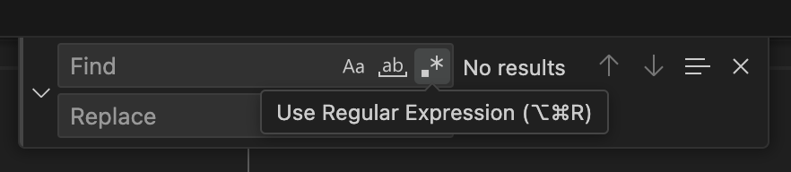

Regular expressions are fundamentally very simple to understand, but they appear complex and people get quickly put off by this.
This is a real shame though because while they look complex, they follow very simple rules and there really are no other tools better than them for the core purpose of manipulating text quickly and efficiently.
I cannot begin to explain the number of hours I have saved with regular expressions, or the jaw drop other people give you when you show them the data they want in moments from a huge mess of log files or CSV data.

You're obviously interested if you're reading this article, so congratulations for wanting to be the best you can be with the tools available.
Without further ado, let's get stuck in.

## What can regular expressions do?

As cliché as it sounds, the real question is "what can't they do" when it comes to text searching and manipulation.
There are no better tools for text searching unless you have very simple needs.
Let's say you've been given a log file from an application, or you have received data in a CSV format and you need to quickly pull out the relevant entries from the file, or you need to put the third column of the CSV file into title case.
These are somewhat achievable with simple text search and replace, but you usually end up having to do some manual editing afterwards or multiple searches to get there.

In comparison, you can use regular expressions like a very expressive scripting language.
The expression tells the editor what you are looking for without being specific about the text itself.
You are generating a pattern, matching digits mixed with punctuation and no text, followed by text, but only including specific letters of the alphabet.
Usually data has a pattern, but it's not simple enough for the search and replace functions in your text editor.
That's where regular expressions rule over all other options.

### Useful links

These are resources I regularly fall back on when I'm working with regular expressions.

Even with lots of experience, you will find that you can never remember all the different tags you can use.
So I often refer to [cheat sheets like this one](https://cheatography.com/davechild/cheat-sheets/regular-expressions/) when I'm writing regular expressions.
They don't usually explain each option or demonstrate matches they can do, but we'll do that in the rest of this blog post.
They are only intended to act as a reminder, not as an education in regular expressions.

The other tool I lean on very heavily is [RegEx 101](https://regex101.com).
This is not only the fastest way to test that your regular expression does what you intended and nothing more, but it also:

- Explains what the regular expression you've entered does in the cleanest way possible for an automated tool.
  This lets you take regular expressions you've seen other people write and get a descriptive explanation of what it's trying to do.
- Lets you save your regular expression alongside your examples so that you can share the URL with someone else.
  This can be especially useful if you're trying to show someone the regular expression you've come up with for them alongside the test cases you used.
  Maybe they'll come back with some additional test cases they've added if they need you to make the regular expression more specific.

## The anatomy of regular expressions

Keeping things simple, you don't input what you're searching for directly, you design a pattern instead.
The pattern describes the individual characters being searched for and can be matched multiple times, but not overlapping.
The pattern can be made up of literal characters you wish to match, but can also contain a number of different tokens that can match a range of characters.

### Basic matching

Each of these tokens are for finding single characters, but some of the examples below include multiple tokens in the pattern and they must all match in the order shown.
Note that matches are case sensitive unless a flag is set during the matching process.
The example matches show all the sections of the string that would match.
Any examples matching spaces use a `•` to make them visible.

| Pattern | Description | Example Matches |
| ------- | ----------- | --------------- |
| `Hello` | A literal string to find. No different from normal search tools. | `Hello` world |
| `.at` | A `.` in the pattern will match any character, including digits, punctuation and spaces. | The `cat` t`hat` wore a `hat` |
| `[aeiou]` | A group of characters in square braces will match one instance of any one of the characters. | H`e`ll`o` w`o`rld |
| `[^13579]` | The `^` at the start of a group makes the group match a single character that **isn't** in the set. | 3.1`4`159`2` |
| `g-l` | Two characters separated by a `-` will match anything in the range, including the characters listed. | IsCod`i`n`g` |
| `\d\D` | Lower case `\d` matches any digit, while upper case `\D` matches anything other than a digit. | 202`5-`0`3-`22 |
| `\w\W` | Lower case `\w` matches any word characters (letters, digits, underscores). Upper case `\W` matches anything other than word characters. | Rege`x•`i`s•`supe`r-`cool |
| `\s\S` | Lower case `\s` matches any whitespace character (spaces, tabs, non-breaking spaces, etc). Upper case `\S` matches anything other than whitespace. | Hello`•w`orld |
| `^here` | A `^` indicates that the characters following it must be at the start of a line. | `here` here |
| `here$` | A `$` indicates that the characters preceeding it must be at the end of a line. | here `here` |

### Complex matching

There are a few concepts that can make writing them expression less verbose, but they are also a bit more difficult to follow until you've tried regular expressions yourself.

#### Quantifiers

These allow a previous matching character to match more than once.
They don't themselves match any characters.

| Pattern | Description | Example Matches |
| ------- | ----------- | --------------- |
| `bea*d` | `*` matches the `a` character zero or more times. | `bed` `bead` beard `beaad` |
| `bea+d` | `+` matches the `a` character one or more times. Note it won't match zero, like `*` does. | bed `bead` beard `beaad` |
| `bea?d` | `?` matches the `a` character zero or one time only. It won't match more than one. | `bed` `bead` beard beaad |
| `wo{2,4}w` | `{2,4}` matches the `o` character two, three or four times only. | ww wow `woow` `wooow` `woooow` wooooow |

Note that the above can be used with any of the basic matching tokens, and not just literal characters.
If you're using a group of characters, they don't have to all be the same repeat for the match to occur.
For example `[aeiou]+` will match `ea` and `i` in breadstick.

It's worth noting that quantifiers in regular expressions are greedy by default.
What does this mean?
It means that if a string can be matched more than one way using quantifiers, it will choose the one where the repeats are as long as possible.
One example is as shown here.

You might expect the pattern `.+,.+` to match `1,2,3,4,5,6` three times, giving `1,2`, `3,4` and `5,6`.
But it would match the first `.+` all the way up to the `5` meaning you get a single match of the whole string.
Adding a `?` after a quantifier tells it to be non-greedy, which can be confusing because `?` is also one of the quantifiers but its meaning is different when immediately after the `.` or `+` quantifier.
So `.+?,.+` would get the three matches you were expecting.

#### Alternative matches

Like a lot of programming languagues, the `|` character lets you switch between alternatives, like an `or` operation.
So `their|there|they're` matches any of those three words.
If you want to include this in the middle of a larger pattern, you'll need to use parentheses `()` around the whole group of alternatives.

#### Grouping and capturing matches

Speaking of parentheses, these are used to group characters that you want to repeat as well, such as `(abc)+` if you want to match one or more back-to-back repeats of `abc`.

Any part of the pattern in parentheses will also be captured.
What this means is that the pattern can be used again later by using back-references.
For example, `b(rain) t\1` captures `rain` as back-reference `\1` and using `\1` in the pattern looks for another instance of `rain`.
This pattern would match `brain train`.

If you don't want to capture the group for any reason, inserting `?:` at the start of the grouped match stops it being captured.
So, for example, `b(?:an)+a` will still match the word `banana`, but there is no capture of the characters `an` or any other capture groups.

#### Lookarounds

Lookarounds are a way of matching a pattern, but only when it is, or is not, next to another pattern.
The additional pattern is not part of the match.

| Pattern | Description |
| ------- | ----------- |
| `fo(?=rt)` | Looks ahead to validate the match. The additional pattern must exist. Matches the two letters `fo` in `fort` and in `fortified` but not in `found`. |
| `fo(?!rt)` | Looks ahead to validate the match. The additional pattern must not exist. Matches the two letters `fo` in `found` but not in `fort` or `fortified`. |
| `(?<=r)ty` | Looks behind to validate the match. The additional pattern must exist. Matches the two letters `ty` in `thirty` and in `forty` but not in `fifty`. |
| `(?<!r)ty` | Looks behind to validate the match. The additional pattern must not exist. Matches the two letters `ty` in `twenty` and `fifty` but not in `thirty`. |

Because the lookaround operations do not consume characters, adjacent matches that would otherwise overlap will still be returned as long as the overlap is within the lookaround pattern of one of the matches.

### Find and replace

Another use for the capturing groups is to allow you to find one pattern and replace it with a new string that uses the original pattern.
The back-references allow for this.
So if you wanted to flip dates around from `yyyy-mm-dd` to `dd-mm-yyyy`, you could use `(\d{4})-(\d\d)-(\d\d)` as the search pattern and the replacement would be `\3-\2-\1`, switching the order of the numbers.

In some implementations of regular expressions, you can also apply modifiers to back-references, such as changing all the words in a document to title case by searching for `(\W)(\w)(\w+)`.
This captures a non-word character as `\1`, the first character of a word as `\2`, and all the rest of the characters as `\3`.
The replacement would be `\1\U\2\L\3` which includes the original non-word character, an uppercase version of the first word character and a lowercase version of all other characters.

By using a pattern such as `([^,]*?),([^,]*?),([^,]*)` you can capture every row of a three column CSV so that the values are in `\1`, `\2` and `\3`.
Then by replacing with `\1,\3,\2` you will have swapped columns 2 and 3, saving you from writing a script to do such an operation.

## How to use them in Visual Studio Code

Regular expressions have always been right in front of you in Visual Studio Code.
You simply turn them on as a mode when searching by enabling the button with a `.*` icon on it.

So give them a try and find out the power you've been missing!

Don't forget to check out my post about [tips and tricks in Visual Studio Code]() for more power user tricks you can do with searching.
This includes using your regular expression to find a pattern, then highlight them all at once so they can be copied.
Once on the clipboard, open a new document and paste, then you have only the sections from the original file that match your pattern.

## How to use them in programming languages

They're also really useful in programming languages.
Especially if you're trying to extract data that has a pattern, but not specific characters, such as looking for dates or codes that have a prefix followed by a unique number.
They can help to extract data, or they can let you validate that something a user entered appears to be correct.
They are often used to try to determine whether a valid email address was entered, for example.

Here are a few examples of how to use them in common modern languages.

| Language   | Regular expression support |
| ---------- | -------------------------- |
| Python     | Import the [`re` package](https://docs.python.org/3/library/re.html) and use `r""` syntax when defining patterns for functions in that package. |
| JavaScript | Use `//` marks instead of `""` when defining a pattern to create a [`RegExp` object](https://developer.mozilla.org/en-US/docs/Web/JavaScript/Reference/Global_Objects/RegExp) which has methods on it like `.test()` to find a match on a string using the pattern. |
| Ruby       | Create a pattern using `//` like in JavaScript to create a [Regexp object](https://docs.ruby-lang.org/en/master/Regexp.html). The object has methods like `.match?()` to check for a match, and `.match()` to give you the matches for processing. |
| C#         | Use the `System.Text.RegularExpressions` namespace to create a new [`Regex` object](https://learn.microsoft.com/en-us/dotnet/api/system.text.regularexpressions.regex), passing the pattern as the initialiser parameter. The pattern can be defined using the regular expression literal syntax which is an `@` in front of the `""` string. |
| Go         | Import the `regexp` package, then use `regexp.Compile()` to create the [`Regexp` object](https://pkg.go.dev/regexp#Regexp). `.MatchString()` on the object returns `true` if the string given is a match. |

## Wrapping Up

So we've taken a look at what regular expressions are, what they can do for you and how you can write your patterns.
The patterns can be hard to get right, and one of the biggest issues is specificity of the pattern.
I cannot begin to tell you the number of times I used to write a pattern and apply it to a file, only to find out a bit later that it matched more than I wanted it to and I've made a mess.
Believe me when I say you get better at predicting these things as time goes by, and regular expressions have easily saved me loads more time than I've spent mastering them.

You can be a master of regular expressions too if you use them whenever possible and you have loads of options online for testing out your regular expression skills.
One game I recommend playing to practice more is [regex golf](https://alf.nu/RegexGolf?world=regex).
This site poses lists of words that you need to match on the left, and lists of words you must not match on the right.
The objective it to write as small a regular expression as you possibly can to make the matches work.
Ignore the score boards, because I'm pretty sure the shortest expressions are somehow faked.
There is no way to write a single character regular expression that passes the first few levels.
