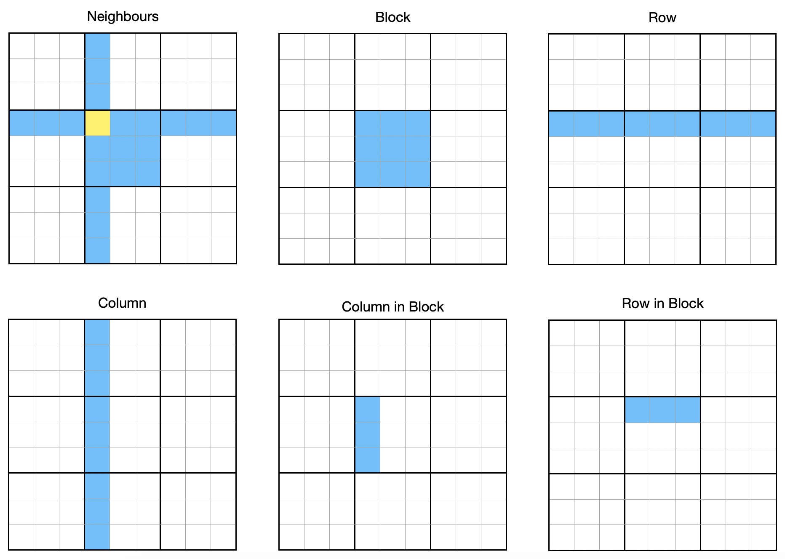

When solving Sudoku puzzles, a lot of the logic is about spotting patterns among groups of cells.
In this context, a group of cells are those which must not contain a number among them more than once.
Let's build some logic to pick out groups of cells we might want to work with in our solving components.

The current code at the time of writing can be found [on GitHub](https://github.com/sdjmchattie/sudoku-solver/tree/blog/2025-07-26) where you can also see the [differences](https://github.com/sdjmchattie/sudoku-solver/compare/blog/2025-07-19...blog/2025-07-26) since the last blog post.

If you like this post and you'd like to know more about how to plan and write Python software, check out the [Python]() tag.
You can also find other posts in the [Sudoku Series]().

## Available Groupings for Cells

Before diving into any design and coding, let's take a look at the sorts of cell groupings that might be useful in Sudoku solving.

- **Neighbours**: Not just an Australian soap, I use this term to describe the group of cells that affect the value of a given cell.
  The value of the cell of interest (yellow in the diagram) cannot match that of any of the cells it is neighbours with.
- **Block**: Each block contains 9 cells and cannot have any repeat values among them.
- **Row**: Each row also contains 9 cells and cannot have any repeat values among them.
- **Column**: OK so I'm not going to write it a third time; these are like rows, but vertical.
- **Column in Block**: 3 cells in the same column within a single 3×3 block.
  While not yet useful, these will become important for some solving techniques.
- **Row in Block**: These are again 3 cells, but in the same row within a 3×3 block.

In addition to retrieving a single cell by its location, we should also be able to create useful groupings as needed.
Because we're dealing with sets, Python can apply operations like `.union()` to join sets together (no duplication in sets).
We can also use `difference()` to remove items from a set using another set.

So if we want all the cells in a block that are alongside a cell of interest, but not from the same column, we can get the block for the cell and the column in block for the cell.
Find the difference between these sets to get the grouping we want.

## Storing Location Information in the Cell

Rather than storing the cells as a 2D list in the grid, I decided to store them in a set instead, embedding their location information in each cell.
To support this, I created a `Point` class which stores an `x` and `y` coordinate as integers.

- `coord` is now a property on the cell that stores the coordinate of the Cell within the grid.
  These range from 0 to 8 for both `x` and `y` where `x` is the column index and `y` is the row index.
- `block` is a property indicating which block on the grid the cell belongs to.
  These range from 0 to 2 for `x` and `y` to capture all nine blocks.
- `block_coord` is a property containing the relative location of the cell within its block.
  This hasn't been needed yet and may be removed later if it's still not being used.

## Retrieving Groupings

The grid has had some new methods added to it to help with finding cells in the patterns shown earlier.

### Support Methods

- `__iter__()` gets an iterator for the grid.
  This allows us to use for loops directly on the grid and makes it easy to build generators over its cells.
  Generators allow us to apply filters to the cells so we can find the ones that should be grouped together.
- `__getitem__()` allows us to retrieve a cell by its coordinates in the grid.
  It is a method used by Python to provide the functionality for the index access for an object, like when you access individual items in a list, for example `my_list[3]` to get the 4th item in the list.
  By accepting a `Point` as the argument, we can find and return the cell at that location.
  Note the use of the generator comprehension with a call to `next()` to get the first item in the generator.
  To avoid raising exceptions, the `next()` method has been given a default value of `None` for when there is no item.

### Grouping Methods

- `get_block_cells()` takes a `Point` describing which block we want the cells for.
  By filtering the cells of the grid for those with a matching block definition, we can return a set of the correct cells.
- `get_column_cells()` takes a column index and an optional row index for the block.
  The row index can be converted into a block `Point` and a predicate defined that returns `True` for a cell with a matching column index and block `Point`.
  The predicate gets applied to the full set of cells to return just the matching cells.
- `get_row_cells()` takes a row index and an optional column index for the block.
  Otherwise, the implementation is identical, swapping axes in the predicate.
- `get_neighbours()` combines the above three methods for a given cell.
  The results of the three methods cover all the cells that are neighbours for the cell and because we're working with sets, we can just union them without worrying about duplicates.
  Before returning the set of neighbours, we can subtract (`.difference()`) a set containing just the original cell.
  That way the yellow cell from the diagram is not included in the set.

## Updating Unit Tests

With all that implementation, it's time to update and add to our unit tests.
Because we changed from a list of lists for the grid into a set and we now use the new `Point` class, we update our existing tests while retaining the original expectations.
When these are once again passing, we can be sure we haven't broken any existing functionality.

New tests for the grouping strategies allow us to have confidence that we're getting the correct cells back from those methods.
Initially, this wasn't the case, and once again, unit tests helped catch bugs, using the wrong coordinate for a given concept.
`x` is for columns, but was accidentally applied to rows in a few places.

In hindsight, it might be appropriate to add extra properties called `column` and `row` to the `Point` dataclass which simply return the values for `x` and `y` respectively.
If it continues to be a source of bugs, we can make that change.
It might even be a great opportunity to look at some of the more Pythonic options available for making this change.

## Wrapping up

We've made some good progress here.
The very next thing we're going to be able to do now that we have groupings of cells, particularly for neighbours, is to get the initial candidates right for each cell.
For our very easy puzzle, this should make the puzzle practically solvable.

Our first solver method, coming shortly after the candidate population, will look for cells with only a single candidate.
It will change the definite value of the cell to the single candidate, then it will remove the value from all the candidate lists of neighbours of the cell.

I hope you're as interested as I've been so far in this project.
I honestly hope we can build a fast solver that is capable of some complicated approaches to Sudoku puzzles.
