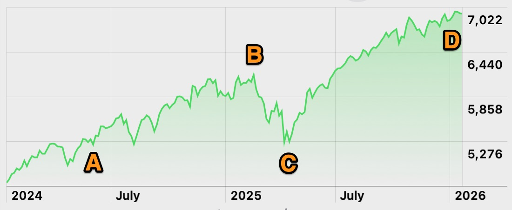

Investing in the stock market has helped me aim for better long-term growth than I could get from a typical savings account, while keeping risk in check with some simple rules and tax-efficient wrappers.
I will share the specific choices that worked for me, the mistakes I will not repeat, and the practical guardrails I now use to stay disciplined.

---

## Disclaimer

***I am not a licensed financial advisor or planner. What I share here comes from my own personal experiences and choices. You should talk to a qualified financial advisor before making any big money decisions. When investing in the stock market, your capital is at risk.***

---

## Why I Chose Stocks Over Just Saving

Savings accounts feel like the safe place to keep money, but many have offered lower-than-inflation interest rates, which means the spending power of that cash erodes over time.
I wanted the chance to outpace inflation, so I chose to invest in the stock market rather than rely solely on a bank savings account.
Research comparing cash ISAs and stocks and shares ISAs supports this trade-off, with analysis showing cash ISAs paid around 3.5% on average last year while a global equities stocks and shares ISA returned about 9.6%.
That gap illustrates why longer-term goals often lean toward investing, while short-term needs still fit better in cash.

I only started investing after building a sufficient buffer in cash.
My personal rule is simple: never invest money I might need in the next few years.
I hold roughly three months of expenses in a regular cash ISA to cover emergencies.
I wouldn't want to be forced to sell shares at a loss because I didn't have a good buffer.
I started small, learned how the mechanics worked, and only increased contributions once I felt comfortable with the process and the volatility.

---

## Using a UK ISA To Keep Returns Tax-Efficient

Because I am in the UK, I use a stocks and shares ISA so that capital gains and dividends are tax-free inside the wrapper.
The adult ISA allowance lets you put up to £20,000 each tax year across ISA types without paying UK tax on interest, capital gains, or dividends within the account.
Outside an ISA, the dividend allowance is £500 for the 2025/26 tax year, and capital gains above the £3,000 annual CGT allowance for 2025/26 can be taxable.
These rules make the ISA a very effective first port of call for long-term investing.

The figures above are correct at the time of writing, but might have changed since.

---

## What I Stopped Doing And Why

I used to invest through a bank’s investment account because it was easy to set up, but the returns were mediocre after fees.
In one year I made about 5% but I now know this was mediocre for the stock, and withdrawals took days to settle.
That combination of higher fees and slower access was enough for me to make a change.
I now use Trading 212 so I can buy shares and ETFs directly without dealing commissions and with support for fractional shares.
Fractional shares mean I can buy just £1 of shares in companies like Apple whose shares are actually worth more than £200 each.
Trading 212 allows many different customers to hold shared interest in a single share which would otherwise not be possible.

Fees still matter, even on low-cost platforms.
For Trading 212 Invest and ISAs, the platform’s own fee is the FX fee on currency conversions, while some other charges come from exchanges and tax authorities.
For example, Stamp Duty Reserve Tax of 0.5% applies on purchases of most London Stock Exchange shares, and US market sell orders include small SEC and FINRA charges.
In practice, I find the app straightforward, and withdrawals have been quick, which makes rebalancing and managing contributions easier.

---

## A Hard Lesson From 2025

In April 2025, a jump in tariff headlines from the US triggered a sharp market drop after a period of gains.
I panicked and withdrew rather than leaving my investments alone.
Not long after, tariff developments shifted and markets recovered quickly, with relief buying lifting major indices back toward highs.
Because I had already pulled out, I missed a significant part of that rebound.

I started my investments in 2024, marked A.
By early 2025, at point B, I'd had returns of around £250 which was better than my cash ISA with a 5% gain.
After the US announced tarrifs for foreign imports, the market lost value quickly.
I did hold out for a while, but then did what you're not supposed to do and panicked.
I asked the bank to sell all of my investments and it took them a few days to do so, meaning I sold at point C, the very worst time to sell it can now be seen.
After the US softened their tarrif rules, the market started recovering quickly but I was not realising any of those gains.
If I hadn't panicked and left my investments in place, I would have seen gains reaching £500 by the end of 2025 at point D.

This episode cemented a core mindset for me: volatility is normal, my plan needs to assume it, and knee-jerk reactions are usually costly.
I've heard it said that the worst enemy for your investment portfolio is you.
I try not to fiddle with it more than necessary.
90% or more of my portfolio is invested and then left alone to gain value on average over time.

---

## The Simple Strategy I Use Today

My top rule is not to put more than around 10% of my portfolio into individual stocks.
Concentration can magnify mistakes, so I use individual holdings sparingly and only for ideas I am willing to hold through rough patches.
The rest goes into selected ETFs that track US, UK, and European markets, which gives me broad diversification across thousands of companies.
Any single company can fail, but in a diversified basket its impact is small and can be offset by others doing well at the same time.

I also pay attention to costs because they compound over time.
Low-cost index ETFs are widely available and provide broad exposure at a fraction of the fee levels investors used to pay.
Some large providers have even reduced fees on popular equity ETFs in recent years, making it easier to keep ongoing costs down.
For my use case, combining broad market coverage with low fees and an ISA wrapper helps me keep more of what the market delivers.

---

## Guardrails And Habits That Keep Me On Track

- I contribute regularly, but I am comfortable pausing contributions during personal cashflow crunches rather than selling investments.
- I avoid making decisions based on headlines, using the 2025 tariff scare as a reminder that markets can fall fast and recover fast.
- I prioritise time in the market over trying to time the market, which keeps me focused on process rather than predictions.
- I revisit my 10% cap on individual stocks whenever a holding appreciates quickly, trimming back if it drifts beyond my risk limit.

---

## What Is My Biggest Mistake?

Honestly, I think my biggest mistake was waiting until now to start.
I could have been putting small monthly amounts into investments for the past 20 years and I would likely have a few tens of thousands of pounds by now.

---

## Wrapping Up

Investing gave me a better chance of outpacing inflation than parking everything in savings, but only after I built a cash buffer, chose a tax-efficient ISA wrapper, and learned to sit tight through volatility.
Moving away from fee-heavy bank investment products, capping individual stock exposure at 10%, and favouring diversified ETFs have all improved my results and removed stress from the process.

If you want to have a go at investing, remember your capital is at risk and don't consider anything you've read here as advice.
I've found it pays to have taken my time while I'm learning.
I've started small, and built confidence with a plan I can live with through the ups and downs.
I would be upset, but not destroyed by the loss of my portfolio.
I wouldn't be investing if I couldn't face that reality.

Just an FYI: I've changed my mind about writing about investing going forward.
This will be my only post on the topic unless I have a change of heart.
