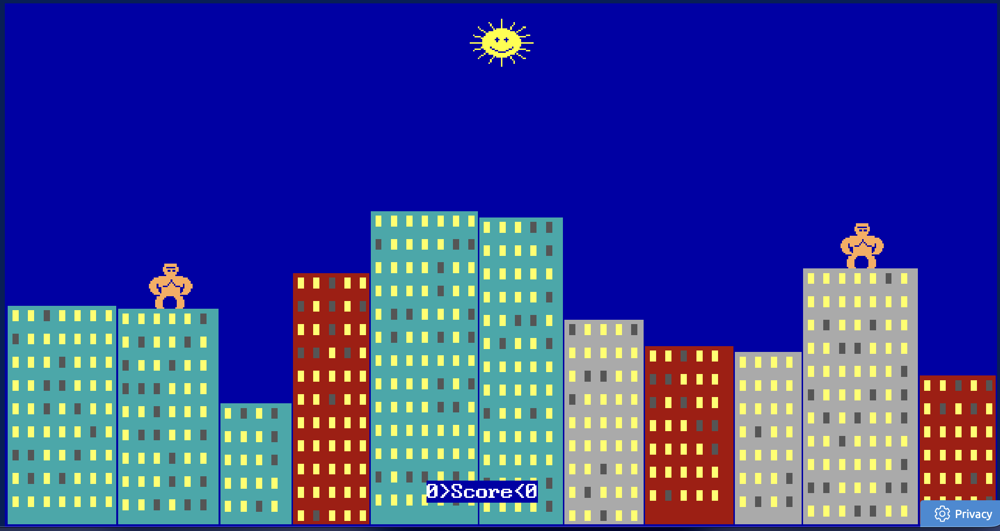
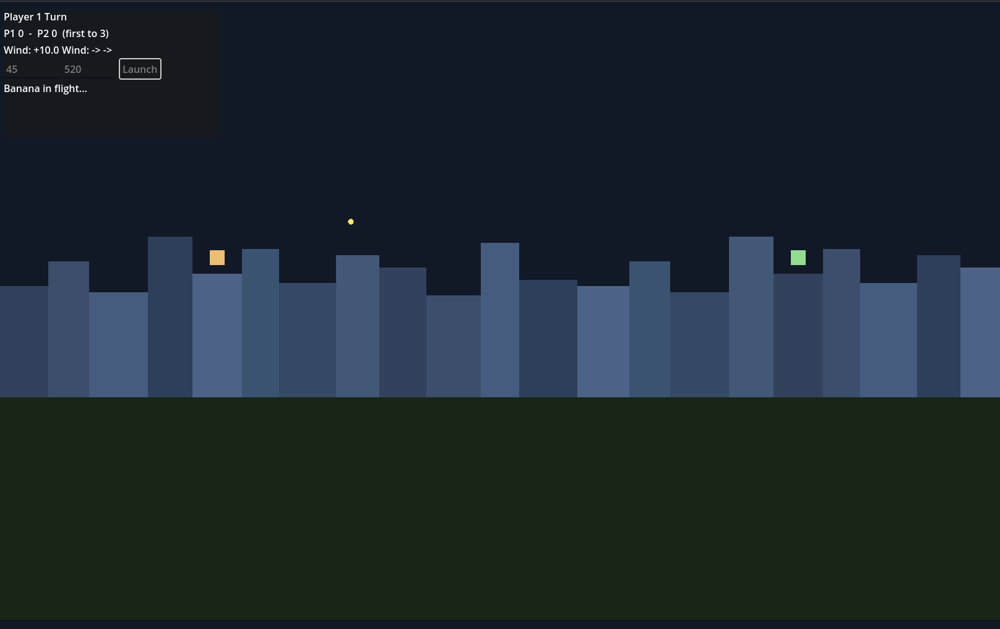
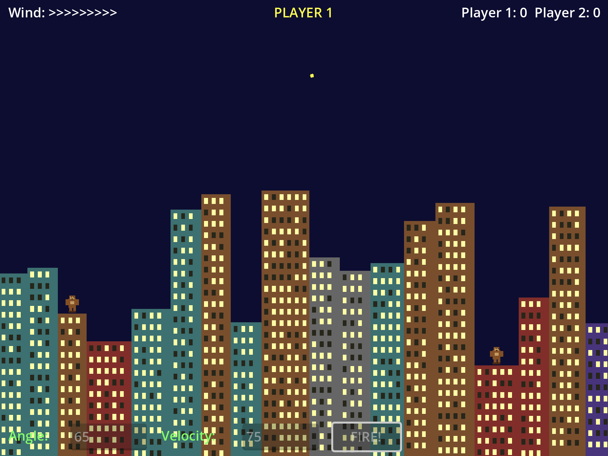

If you grew up with a DOS machine in the early 1990s, there is a good chance you remember Gorillas.
Two apes perched on rooftops, hurling explosive bananas across a city skyline — it shipped free with QBasic and it was many people's first taste of programming a game, or at least playing one they could peek inside.
I thought it would make the perfect test for a question I have been wanting to answer: what happens when you hand two of the most capable agentic coding tools the exact same brief and step back?

In my recent [Sudoku solver post]() I mentioned that I had been using Claude Code and planned to write about it.
And in my [Advent of Code 2025 retrospective]() I speculated about OpenAI's Codex as a tool for writing whole applications.
This post delivers on both of those promises.

## What Is The Gorillas Game?

Gorillas was a turn-based game bundled with Microsoft QBasic in 1991.
Two gorillas stand on the rooftops of a procedurally generated city skyline.
Each turn, you enter an angle and a velocity, and your gorilla lobs an explosive banana across the screen.
Wind affects the trajectory, buildings get destroyed on impact, and the first player to hit the other gorilla wins the round.
If you have never played it, or if you just want a hit of nostalgia, you can [play the original in your browser](https://classicreload.com/play/qbasic-gorillas.html).

It makes a surprisingly good benchmark for agentic coding tools.
The scope is well defined, but the implementation touches physics, collision detection, procedural generation, turn-based game logic, and user input — enough complexity to reveal how each tool thinks without being an open-ended project.

## The Experiment

Both tools received the same starting prompt:

> Do you remember the game for Quick Basic with gorillas hurling bananas across a city scape?
> I want to recreate that in Godot and support dynamic generation of the city skyline.
> However, I'm happy to use a constant cityscape while getting the banana flight and explosion correct if that's easier.
> Ask questions.

That was it.
No extra guidance, no follow-up hints about architecture or style.
From that point, each tool asked its own clarifying questions and then built the game.

Claude Code was running Anthropic's Opus 4.6 model, and Codex was running OpenAI's gpt-5.3-codex model.
Both were set to a medium effort level.
Both targeted Godot 4.5.1 as the game engine.

You can find the full session transcripts and all source code in the [comparison repository on GitHub](https://github.com/sdjmchattie/claude-code-vs-codex), and you can play both finished versions in your browser:

- [Codex's Gorillas](https://stuart.mchattie.net/claude-code-vs-codex/codex/)
- [Claude Code's Gorillas](https://stuart.mchattie.net/claude-code-vs-codex/claude-code/)

I would encourage you to try both before reading on — it is interesting to form your own impressions first.

## How Each Tool Approached Clarification

Before writing a single line of code, both tools asked clarifying questions.
The way they went about it, though, was quite different.

### Codex: in rounds

Codex asked three questions at a time, across three separate rounds, for nine questions in total.
This felt more like pair-programming.
Each round of answers shaped the next set of questions, which means the design evolved iteratively.
The trade-off is that Codex's later questions may have been influenced by assumptions it formed from your earlier answers, which can narrow the design space in ways you do not always notice.

### Claude Code: all at once

Claude Code presented all nine of its clarifying questions in a single batch.
You answer everything up front, and then the tool goes away and builds.
It is efficient — there is minimal back-and-forth — but it also means you are committing to a full specification before seeing any output.

## Architectural Choices

This is where the two tools diverged most dramatically.

### Monolith vs components

Codex took a component-based approach, splitting the game across multiple scenes and scripts with dedicated systems for the game controller, HUD, explosions, wind, and projectiles.

Claude Code produced a single Godot scene with a single script of around 400 to 500 lines.
Everything lives in one place: the city generation, the physics, the input handling, and the rendering.

Neither approach is objectively wrong for a game this size.
Codex's architecture would scale better if you wanted to extend the game, but for a self-contained recreation it introduces a lot of redirection that makes the code harder to follow.
Claude Code's monolith is simpler to read and debug.

### Physics implementation

Codex used Godot's `RigidBody2D` node with wind applied as a continuous physical force.
This gets wind behaviour for free from the engine, but the projectile moves much faster than the original game and the arc feels less deliberate.

Claude Code used parametric equations to calculate the banana's trajectory — essentially hand-rolled physics that produces a smooth, deterministic arc.

### Collision detection

Codex regenerated polygon colliders dynamically after each explosion using `BitMap.opaque_to_polygons()`.
This is more physically correct and integrates with Godot's physics system, but it is also considerably more complex.

Claude Code sampled pixel alpha values to detect when a banana hit a building.
It is a simple, pixel-perfect approach that works well for a 2D game rendered to a texture.

### Skyline generation

Codex used a fixed skyline with an extensible provider interface designed so a procedural generator could be swapped in later.
Architecturally forward-thinking, but in practice the skyline is static.

Claude Code generated the city skyline procedurally at runtime, just like the original game.
This was included as part of the one-shot output, which is impressive given that it was not the main focus of the prompt.

### Viewport and presentation

Codex used the default Godot viewport size.
The result looks more modern but loses the retro feel entirely.

Claude Code chose a 640×480 retro viewport with pixel filtering, matching the original game's proportions.
This gives the whole game a nostalgic character that feels right.

## Bug Count and Post-Implementation Work

Codex's version had two bugs that made it unplayable out of the box.
The first was a self-hit detection issue where every throw immediately exploded on the gorilla that threw it, making the game completely unplayable.
The second placed gorillas off-screen in certain configurations, making some rounds impossible.
Both were fixed after I pointed them out to Codex, and to its credit it resolved them quickly.

Claude Code's game worked on the first run.
One bug did surface later: when a gorilla is hit, it disappears as part of the win screen but never reappears.
The invisible gorilla can still throw bananas and be struck in the next round — you just cannot see where it is.
That makes aiming in subsequent rounds a guessing game, which is a genuine gameplay problem even if the mechanics still work underneath.

More moving parts means more surface area for bugs.
That is not necessarily a criticism of Codex's architecture, but it is a practical reality.

## Playing Both Versions

If you have not tried them yet, now is a good time:

- [Codex's Gorillas](https://stuart.mchattie.net/claude-code-vs-codex/codex/)
- [Claude Code's Gorillas](https://stuart.mchattie.net/claude-code-vs-codex/claude-code/)

Codex's version is initially impressive given the short prompt and the few minutes of work from the model.
But it does not look like the original game.
The gorillas are represented by squares, the projectiles are fast-moving circles, and the interface feels small and complex.
The game does not handle window resizing well, and it is possible for the gorillas to spawn far enough apart that they cannot throw hard enough to reach each other.
The explosions, at least, have a decent visual effect.

Claude Code's version immediately looks like Gorillas.
The bananas fly slowly and arc through the air just like the original.
The gorillas look like gorillas.
Wind is shown as a row of sideways-facing arrows, faithfully recreating the original's presentation.
The game supports window resizing, and the procedural city generation means every round feels fresh.
It captures the nostalgia of the original in a way that Codex's version simply does not.

## Which Tool Would I Reach For?

For this particular experiment, Claude Code was the more impressive result.
It delivered a faithful, playable recreation from fewer inputs, with the retro look and feel nailed from the start.
The monolithic approach suited a project of this scope perfectly — there was no need for the architectural overhead that Codex introduced.

Codex's architecture was more sophisticated and production-minded, and in a larger project that modularity would be valuable.
But the actual game experience fell short of the original.
It did not capture the feel of Gorillas, and the initial bugs meant it was unplayable until I intervened.

There is also something to be said for transparency during the process.
Claude Code's interface made it clear what actions it was taking at each step.
It did not narrate every decision, but by the time it finished I felt I understood the solution before I even opened the project.
With Codex, I spent a long time studying the output before I could get to grips with how the project was structured, and I had to explicitly ask it to explain parts of what it had built.
When you are the one responsible for the code, that clarity matters.

Both tools were running their respective providers' latest models — Opus 4.6 for Claude Code and gpt-5.3-codex for Codex — at a medium effort level, so this was a fair head-to-head.
Based on that comparison, Claude Code's approach of getting it right the first time was more valuable than Codex's approach of building for the future.

## Wrapping Up

The fact that both tools produced a fully playable game from a single natural-language prompt is remarkable, regardless of the differences between them.
We are at a point where you can describe a game you remember from 1991 and have working code in minutes.
The question is no longer whether these tools can build software — it is how they build it, and which trade-offs suit your needs.

If you would like to get started with Claude Code yourself, I will be publishing a tips and tricks post soon — keep an eye on the [Agentic AI]() tag.
In the meantime, I would encourage you to [play both versions](https://github.com/sdjmchattie/claude-code-vs-codex) and see which one brings back the nostalgia for you.

Happy coding!
