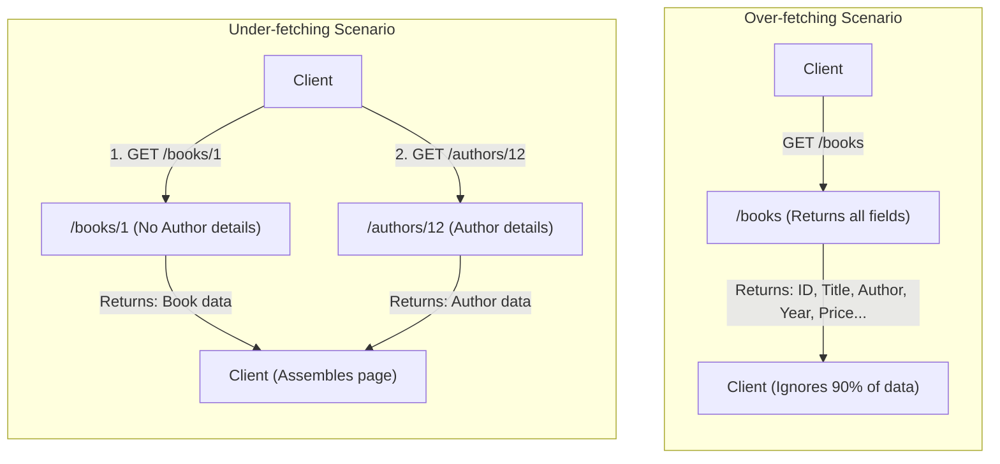
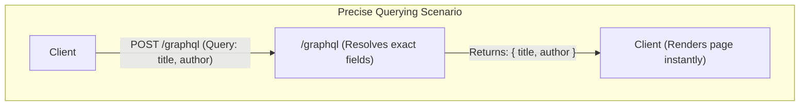

Connecting client applications to database records requires a clear, reliable communication contract.
For years, Representative State Transfer (REST) has served as the default architecture for modern web applications.
If you read my previous guide, [Building Modern APIs with FastAPI and Python](), you saw how easy it is to define clear routes and return structured Pydantic models.
However, as client interfaces grow more complex, the rigid response shapes of REST can introduce development friction and performance bottlenecks.

In this post, I explore GraphQL as an alternative API architecture.
I'll explain what GraphQL is, compare it directly to a RESTful FastAPI approach, and demonstrate how to build a clean, type-safe schema using Strawberry.
Finally, I'll detail the scenarios where GraphQL shines and when you should avoid using it.

## The Core Concept of GraphQL

GraphQL is a query language for APIs and a runtime for fulfilling those queries using your existing data.
Instead of exposing multiple endpoints representing resource collections, a GraphQL API exposes a single URL.
Clients submit structured queries to this endpoint specifying exactly which fields they require.

This design shifts control of data delivery from the server to the client.
To understand why this shift matters, consider how client applications typically retrieve relational data.

### Over-fetching and under-fetching

In a REST API, endpoints return pre-determined, fixed JSON structures.
If you build a client dashboard that only needs a book's title, calling `GET /books` still forces you to download author names, publication years, and descriptions.
This is known as over-fetching, which wastes network bandwidth and processing memory.

Conversely, if you need to display a book along with its author's profile details, a simple books endpoint might not contain the author's biography.
You must first call `GET /books/{id}` and then make a second request to `GET /authors/{author_id}`.
This under-fetching pattern results in multiple round-trips to the server, degrading the user experience on slower connections.

To visualise how REST APIs handle these scenarios, look at the request patterns below:



GraphQL solves both problems simultaneously.
A client sends a query detailing the exact structure of the desired response, and the server returns a JSON payload matching that structure precisely.

To visualise the GraphQL approach, look at how the same requirements are solved in a single query:



## GraphQL vs. FastAPI: A Direct Comparison

If you're already familiar with FastAPI, you know it uses Pydantic to validate requests and document responses.
Choosing between RESTful FastAPI and a GraphQL-based FastAPI service depends heavily on your application's architecture and usage patterns.

### Decoupled client requirements

If you are building a service that supports web apps, mobile apps, and third-party integrations, their data requirements will differ.
Using REST requires you to either build custom endpoints for each client or accept that some clients will over-fetch data.
GraphQL decouples your backend development from frontend UI changes.
When a designer adds a new field to the user interface, you don't need to write a new API route; the client simply updates its query string to include the new field.

### LLM agents and API consumption

The rise of the Model Context Protocol (MCP), which I explored in my post on [Building Agentic System Tools with FastMCP and Python](), demonstrates how critical structured tool access is for AI agents.
GraphQL offers a unique advantage when consumed by Large Language Models (LLMs).
Instead of requiring an LLM to navigate a complex web of REST endpoints and parse massive, redundant JSON payloads, you can give the agent a tool to execute GraphQL queries.
The agent can inspect your schema and write a precise query that fetches only the exact context variables it needs to answer a prompt.
This minimises prompt tokens and improves agent efficiency.

### Caching and complexity

Despite its flexibility, GraphQL introduces caching challenges that REST handles natively.
In a RESTful architecture, every resource is identified by a unique HTTP Uniform Resource Identifier (URI).
For example, if multiple clients request `GET /books/1`, a browser, CDN, or proxy cache (such as Varnish or Cloudflare) will intercept the first request, fetch it from the server, and store the response.
Subsequent requests for `GET /books/1` are then served instantly from the cache, completely bypassing the backend database.

If you naively place an HTTP cache in front of a GraphQL service, this caching model breaks entirely.
Because GraphQL routing sends all queries as `POST` requests to a single `/graphql` endpoint, the cache cannot differentiate between requests based on the URL alone.
If the cache is configured to ignore request bodies, a query requesting `{ books { title } }` might mistakenly return the cached result of a completely different query, such as `{ book(id: 1) { author } }`.
This returns incorrect, mismatched data to the client.
Conversely, if the cache follows standard HTTP specifications, it will bypass `POST` requests entirely, forcing every single query to hit the backend server.

To resolve this complexity, you cannot rely on simple HTTP edge caching.
Instead, caching must be managed on the client side using libraries like Apollo Client or Relay, which cache data fields at the entity level in memory.
Alternatively, you must implement persisted queries on the server.
This technique registers client query strings as hashes, allowing the client to execute queries using `GET /graphql?queryId=<hash>`, thereby enabling standard HTTP gateways to cache the responses safely.

## Python Implementation with Strawberry and FastAPI

To build a GraphQL API in Python, I recommend using Strawberry.
Strawberry is a code-first library that leverages native Python type hints to generate your GraphQL schema automatically.
This aligns perfectly with FastAPI's design philosophy, allowing you to maintain type safety from database models all the way to your API schema.

To demonstrate how simple this is, you'll create a basic books API that supports both queries and mutations.

### Setting up the environment

First, initialise a new project and install FastAPI, Uvicorn, and Strawberry with FastAPI support.
You can use `uv` to manage your environment and dependencies:

```bash
# Initialise a new Python project managed by uv
uv init

# Add the required dependencies to the project
uv add fastapi uvicorn "strawberry-graphql[fastapi]"
```

### Writing the application

Open and edit the default `main.py` file created by `uv init` to implement your type-safe schema.
You can download the completed, unified <a href="main.py" download="main.py">main.py</a> script directly to use as a reference.

First, you'll import the dependencies, define your `Book` data structure using the `@strawberry.type` decorator, and initialise an in-memory database:

```python
import strawberry
from fastapi import FastAPI
from strawberry.fastapi import GraphQLRouter

# Define the GraphQL representation of a Book using decorators
@strawberry.type
class Book:
    id: int
    title: str
    author: str
    year: int

# In-memory database representation
BOOKS_DB = [
    Book(id=1, title="1984", author="George Orwell", year=1949),
    Book(id=2, title="Dune", author="Frank Herbert", year=1965),
]
```

Strawberry inspects the native Python type hints in your class to generate corresponding fields in the GraphQL schema automatically.

Second, create the `Query` class to serve as the entry point for fetching data:

```python
# Define queries to fetch data
@strawberry.type
class Query:
    @strawberry.field
    def books(self) -> list[Book]:
        """Retrieve all books from the collection."""
        return BOOKS_DB

    @strawberry.field
    def book(self, id: int) -> Book | None:
        """Retrieve a specific book by its unique identifier."""
        return next((b for b in BOOKS_DB if b.id == id), None)
```

The resolver methods decorated with `@strawberry.field` handle the execution logic for retrieving the full list of books or finding a single book by its identifier.

Third, create the `Mutation` class to handle state-modifying requests:

```python
# Define mutations to modify data
@strawberry.type
class Mutation:
    @strawberry.mutation
    def create_book(self, id: int, title: str, author: str, year: int) -> Book:
        """Add a new book to the database."""
        new_book = Book(id=id, title=title, author=author, year=year)
        BOOKS_DB.append(new_book)
        return new_book
```

By decorating a method with `@strawberry.mutation`, you define a write endpoint that takes parameters, appends a new record to the list, and returns the newly created type.

Finally, combine these classes into a unified schema and integrate it into FastAPI:

```python
# Combine Query and Mutation types into a unified Schema
schema = strawberry.Schema(query=Query, mutation=Mutation)

# Initialise the Strawberry router and integrate it with FastAPI
graphql_app = GraphQLRouter(schema)

app = FastAPI(title="GraphQL API")
app.include_router(graphql_app, prefix="/graphql")
```

To expose this schema, you pass it to Strawberry's `GraphQLRouter`, which integrates directly as a sub-router into a standard FastAPI application.

### Running and testing the API

You can launch the development server within your `uv` environment using Uvicorn:

```bash
uv run uvicorn main:app --reload
```

Once the server starts, navigate to `http://127.0.0.1:8000/graphql` in your browser.
Strawberry provides an interactive GraphiQL playground where you can construct queries, view schema documentation, and execute mutations.

To retrieve only the titles and publication years of your books, you can run the following query:

```graphql
query {
  books {
    title
    year
  }
}
```

This returns a clean payload containing only the requested fields, avoiding any over-fetching.

## Scaling Your Schema

As your application grows, defining all operations inside a single file becomes impractical.
If you have dozens of domain models like users, orders, billing, and reviews, your central query and mutation classes will quickly grow huge.
Fortunately, GraphQL and Strawberry make it easy to modularise your schema without writing complex boilerplate.

### Splitting by domain

Instead of a single monolithic file, you can organise your codebase by domain.
You can create a separate directory or file for each resource, such as `users/`, `books/`, and `orders/`.
Within each domain, you'll define the GraphQL types, the query resolvers, and the mutation resolvers that belong to that specific domain.
This keeps related logic grouped together, making the codebase much easier to navigate and maintain as a developer.

### Combining queries and mutations

Once you've split your queries and mutations into domain-specific classes, you need to combine them into a single root query and root mutation.
Strawberry supports two primary patterns to achieve this integration.

#### Python class inheritance

You'll define your root `Query` and `Mutation` classes by inheriting from all the domain-specific query and mutation classes.
Python supports multiple inheritance, so your root class simply inherits from `BookQuery`, `UserQuery`, and `OrderQuery`.
At runtime, Python resolves all fields from the parent classes, presenting a single unified interface to your GraphQL schema.
However, you must be careful when naming resolvers across different base classes.
If two parent classes define resolvers with the same name, [Python's Method Resolution Order (MRO)](https://docs.python.org/3/reference/datamodel.html#the-order-of-method-resolution) resolves to the class listed first, silently shadowing the other resolver and omitting it from the generated schema.

#### Strawberry type merging

If your domain query classes have conflicting configurations or you prefer composition over inheritance, you can use Strawberry's built-in tools module.
The `strawberry.tools` module provides a utility function named `merge_types`.
This function allows you to combine separate classes programmatically without relying on standard Python subclassing.

To merge your query types, you call `merge_types` by passing two arguments.
The first argument is a string representing the name of the new, combined type you want to create (such as `"Query"`).
The second argument is a tuple containing the individual domain-specific query classes you wish to combine (such as `BookQuery` and `UserQuery`).
You repeat this process for your mutation classes to create a combined mutation type.

For example, to merge separate queries into a single root query:

```python
from strawberry.tools import merge_types
from app.books.queries import BookQuery
from app.users.queries import UserQuery

# Combine individual domain queries into a single root Query class
Query = merge_types("Query", (BookQuery, UserQuery))
```

Under the hood, Strawberry inspects the fields of each input class, copies their resolver logic, and dynamically creates a new, unified type.
Importantly, this helper provides strict validation.
If two of your classes define fields with identical names, `merge_types` will immediately raise a validation error during application startup.
This prevents silent shadowing and helps you catch name clashes early in the development cycle.
Once you've generated your merged query and mutation classes, you pass them directly to `strawberry.Schema` to initialise your endpoint.

By using these scaling techniques, you ensure your codebase remains highly modular.
Your team can work on separate domains in parallel without causing git merge conflicts on a single monolithic file, all while the client continues to see a single, seamless endpoint.

## When Not to Use GraphQL

While GraphQL is incredibly powerful, it is not a silver bullet.
I recommend sticking to a RESTful FastAPI approach in the following situations:

1. **Simple Microservices:** If your backend consists of simple CRUD resources without complex relational joins, setting up a GraphQL schema introduces unnecessary boilerplate and query parsing overhead.
2. **Heavy File Uploads:** While possible, uploading multipart files through GraphQL is clunky and non-standard compared to simple HTTP POST endpoints in REST.
3. **HTTP Caching Dependencies:** If your application relies heavily on CDN edge caching or varnish cache rules, REST's URI structure is much easier to manage.
4. **Security Vulnerabilities:** Because clients can request arbitrary structures, a malicious user can write a deeply nested query (e.g., querying recursive relationships) that triggers massive database loads.
   Protecting against this requires implementing complexity filters and depth limits.

## Wrapping Up

GraphQL offers a highly flexible, client-driven alternative to traditional REST APIs.
By using Strawberry and FastAPI, you can build a type-safe API that leverages your existing Python type annotations to generate schemas automatically.
This allows your frontends to evolve independently and enables LLM agents to query your systems with surgical precision.

Happy coding!
