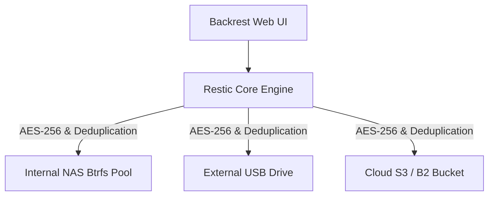
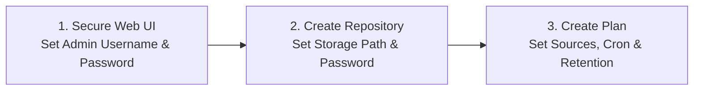


Backrest provides an intuitive web interface on top of Restic, turning command-line backup scripts into a dependable, automated backup platform.
It combines content-addressable deduplication and encryption with schedule management and webhook alerting.

- **Restic backend:** Benefit from fast snapshot deduplication, authenticated encryption, and diverse storage backends.
- **Web UI management:** Configure backup plans, inspect snapshot file trees, and restore files from an intuitive browser dashboard.
- **Optimised for drives:** Tune pack sizes and prune operations to minimise write amplification on SMR disks.
- **Automated scheduling:** Set cron-based backup cadences and receive health alert pings via healthchecks or webhooks.


Setting up automated backups is often the most overlooked task in home networking.
It is rarely the most exciting project to tackle, but having a solid backup system gives you immense peace of mind when hardware fails.

While Windows and macOS offer plenty of built-in and commercial backup tools, Linux homelabs require a different approach.
Restic combined with a modern web interface like Backrest is widely considered one of the gold standards for Linux backups.
You can run Backrest and Restic on Windows and macOS as well, but this guide focuses specifically on Linux and containerised NAS environments.

I recently moved my primary backup workflow to a UGREEN NASync DXP2800 running Docker, but the setup I use applies to any Linux server or workstation.
In this guide, I'll walk you through setting up Backrest, configuring your first repositories and plans, and avoiding common traps like drive choking on SMR disks.
Towards the end, I'll also compare this approach against alternatives like Borg and native NAS tools so you can see why Backrest and Restic are recommended.

## Core Concepts

Before deploying any software, it helps to understand how Restic and Backrest structure your data.
Restic is a CLI tool that handles the underlying encryption, deduplication, and repository storage.
Backrest acts as an orchestrator, adding scheduled automation and a clean web interface on top of Restic.

Restic and Backrest structure backups using two key concepts:

* **Repository (Repo)**: A native Restic concept representing the target destination where your encrypted backup data, index files, and snapshot metadata live.
* **Plan**: A Backrest concept that wraps Restic CLI tasks into an automated job, defining which source directories to back up, when to run on a cron schedule, and how many old snapshots to keep.

Managing a repository also relies on three essential Restic CLI maintenance operations:

* **Check**: Scans repository index files and cryptographic hashes to verify that your backup data has not suffered from corruption.
* **Forget**: Evaluates your retention policy against existing snapshots and removes reference tags from snapshots you no longer need.
* **Prune**: Reclaims physical disk space by finding unreferenced data packs left behind by forgotten snapshots and deleting them from storage.

## Architecture

The diagram below illustrates how Backrest orchestrates Restic to manage backups across local NAS storage, external drives, and cloud targets.



## UGREEN NAS Setup

Deploying Backrest via Docker Compose on a NAS gives you a centralised backup controller.
Below is the exact `docker-compose.yml` configuration I run on my UGREEN DXP2800.

```yaml
services:
  backrest:
    image: ghcr.io/garethgeorge/backrest:latest
    container_name: backrest
    restart: unless-stopped
    ports:
      - 9898:9898
    deploy:
      resources:
        limits:
          cpus: "2.0"
          memory: 2000M
    environment:
      - BACKREST_PORT=9898
      - BACKREST_DATA=/data
      - BACKREST_CONFIG=/config/config.json
      - XDG_CACHE_HOME=/cache
    volumes:
      # Application cache, config, data, and rclone paths
      - /volume1/docker/backrest/cache:/cache
      - /volume1/docker/backrest/config:/config
      - /volume1/docker/backrest/data:/data
      - /volume1/docker/backrest/rclone:/root/.config/rclone

      # Read-only source NAS volume
      - /volume1:/volume1:ro

      # Backup destinations and USB auto-mounts
      - /mnt/media_rw:/media
      - /mnt/@usb:/mnt/@usb:rslave

      # System time synchronization
      - /etc/localtime:/etc/localtime:ro
```

Setting resource limits prevents CPU-heavy deduplication tasks from slowing down other containerised services on your NAS.
Mounting your primary NAS volume `/volume1` as read-only (`:ro`) protects your source data against accidental overwrites during backup operations.
If you need to perform a restore back to `/volume1`, you can temporarily edit the compose file to allow write access during the restore window.

The USB volume mapping uses an important Linux container trick.
UGREEN NAS mounts external USB drives by their UUID inside `/mnt/media_rw/`, which are actually symlinks pointing to device paths like `sda1` or `sdb1` inside `/mnt/@usb/`.
By mounting `/mnt/@usb` into the container using `rslave` propagation, any USB drive plugged into the NAS while the container is running is passed through dynamically without needing to restart Docker.

## Getting Started with Backrest

Once your container is running, open your browser and navigate to `http://<your-nas-ip>:9898`.



### 1. Secure your Web UI

Your first step should always be securing the web interface.
When accessing Backrest for the first time, navigate to the settings page and configure an admin username and password.
This prevents unauthorised users on your local network from altering your backup schedules or viewing repository keys.

### 2. Create your first repository

Click **Add Repo** in the Backrest interface to register a storage location:

1. **Repo ID**: Choose an immutable, descriptive ID based on the physical drive hardware (such as `wd-elements-4tb` or `seagate-expansion-2tb`). Because Backrest Repo IDs cannot be renamed later, referencing the manufacturer, model, and drive capacity ensures you can always identify the physical disk.
2. **Storage Uri**: Specify the target path within the `/media` mount (mapped to `/mnt/media_rw` on the host) using the drive's UUID (for example, `/media/12345678-1234-1234-1234-123456789abc/backups`). Check this path carefully to ensure you target the drive's primary storage partition rather than a random system or recovery partition.
3. **Password**: Enter a strong encryption password to secure your repository data.

> ⚠️ **Warning:** Save your repository password in a password manager immediately.
> If your server suffers a catastrophic hardware failure, your encrypted repository is completely unrecoverable without this password.

### 3. Create your first plan

Click **Add Plan** to define what data to back up:

1. **Paths**: Specify the source directories you want to protect (such as `/volume1/documents`).
2. **Schedule**: Enter a standard cron expression (for example, `0 2 * * *` to run daily at 02:00 AM). You can use an online editor like [crongen.dev](https://crongen.dev) to build and test custom cron expressions.
3. **Repository**: Select the Repo you created in the previous step.
4. **Retention**: Set retention policies to automatically keep a set number of daily, weekly, or monthly snapshots.

## SMR Drive Tuning

If you use an external 2.5-inch USB hard drive as a backup target, you might encounter performance issues during large initial backups.
When I started my first major backup run, performance was fast for the first 50 to 100 gigabytes before dropping to a crawl.
Disk latency spiked and write speeds collapsed to single-digit megabytes per second.

This slowdown occurs because higher-capacity 2.5-inch external hard drives rely on Shingled Magnetic Recording (SMR) to fit high storage densities into a compact physical form factor.
SMR drives overlap magnetic tracks like roof shingles to maximise capacity, using a small internal conventional cache buffer to handle incoming writes.
Because Restic compresses and deduplicates data into many small 16 MB pack files by default, the stream of small non-sequential writes quickly overflows the drive's cache.
The drive controller is then forced into constant read-modify-write cycles across overlapping tracks, choking disk throughput.

You can significantly reduce this impact by increasing Restic's target pack size to 128 MB.
In Backrest, the recommended way to configure this is by adding `RESTIC_PACK_SIZE=128` under the **Environment Variables** section for your plan or repo.
Avoid adding `--pack-size 128` as a custom CLI flag, as custom flags are passed to all Restic operations and will cause errors on commands like `check` or `forget` that do not accept pack size parameters.

Larger pack sizes force Restic to buffer data into bigger contiguous blocks before writing to disk, lengthening sequential write spans and reducing drive thrashing.
It is important to understand that this does not magically fix SMR speed limitations.
In my case, tuning the pack size trimmed an unbearable multi-week estimate down to roughly 4 days for a large initial backup.
It keeps disk I/O stable and prevents severe drive thrashing, but you must still prepare for a multi-day initial backup run.

Once the initial backup is finished, incremental backups run very quickly because Restic only needs to read index files and write a few new packs for modified files.

Drive characteristics should also shape your maintenance schedule.
Running a `check` or `forget` operation is fast on SMR drives, but running a `prune` operation is brutal because it rewrites non-sequential data packs.
A practical strategy for SMR drives is to only run `prune` when your backup drive is nearly full, and allow it to run as a multi-day background task.

## Filesystem Choice

Selecting the right filesystem for your backup drives requires balancing Linux NAS performance with disaster recovery access.

For internal NAS storage pools, `Btrfs` is a strong option because it provides copy-on-write snapshotting and pool-level checksumming.
For external USB drives attached to a Linux NAS, `ext4` is by far the best choice.
Using non-Linux filesystems like NTFS or exFAT on your NAS backup targets can introduce significant write overhead and risks stripping POSIX metadata that Restic uses to ensure robust backups.

You should still consider how you would recover data if your primary NAS hardware suffers a catastrophic failure.
If your NAS dies and you need to plug your `ext4` backup drive directly into a macOS or Windows machine, mounting `ext4` read-only on those systems is painful, but entirely possible using WSL2 or third-party drivers.
Sticking with `ext4` on Linux backup targets guarantees optimal performance and metadata integrity during daily backup runs, while keeping an emergency recovery path open.

## Cloud Backups

While local NAS repositories protect against accidental file deletion or local drive failure, storing an offsite copy protects your data against fire or hardware theft.
Restic natively supports cloud destinations using the exact same repository encryption and deduplication model.

Backrest allows you to add cloud destinations alongside your local repositories, supporting Amazon S3, Backblaze B2, Google Cloud Storage, and Azure Blob Storage.
Because Restic encrypts data client-side before uploading, your cloud provider cannot read your files or view directory structures.
Adding a Backblaze B2 or S3 bucket as a secondary repository target provides inexpensive offsite protection for your most critical data.

## Comparing Backup Options

Choosing the right backup software often comes down to interface usability, storage efficiency, and licensing models.
While command-line Restic is exceptionally reliable on its own, adding Backrest as a web dashboard makes monitoring automated jobs much easier.

Borg is another popular backup tool in the Linux ecosystem, but its web interface ecosystem presents trade-offs.
Many web interfaces built for Borg suffer from freemium licensing models or lock scheduling features behind commercial paywalls.
Backrest is completely free and open-source software, offering full multi-repository management, custom pre/post hooks, and health notifications out of the box.

| Feature | Backrest & Restic | Borg & Borg UIs |
| :--- | :--- | :--- |
| **Interface** | 100% Free Open-Source Web UI | CLI / Freemium Web UIs |
| **Deduplication** | Content-defined chunking | Content-defined chunking |
| **Encryption** | AES-256 client-side | AES-256 client-side |
| **Destinations** | Local NAS, USB, Cloud S3/B2 | Local NAS, SSH server |
| **Reliability** | Cryptographic hash checks | Cryptographic hash checks |
| **Multi-Repo Management** | Built directly into Web UI | Varies by UI wrapper |

### Why not native UGREEN backup?

You might also wonder why it is worth running Backrest when UGREEN includes a native Backup & Sync application in UGOS.
UGREEN's built-in application focuses primarily on making your NAS a destination for backups from client PCs and phones, rather than protecting the data stored on the NAS itself.

The best option UGOS provides for backing up the NAS itself is syncing to another UGREEN NASync device.
While that arrangement is convenient for UGREEN's hardware sales, buying a second NAS is an expensive and restrictive requirement for homelab users.
Furthermore, the native app offers limited snapshot retention history and does not share encryption keys directly with you as the end user.
If those keys are stored locally on the source NAS, a catastrophic hardware failure leaves you vulnerable and unable to decrypt your backups on another system.

Running Backrest in Docker avoids these vendor constraints entirely.
Your backups are stored in open, standardised Restic repositories with client-side AES-256 encryption, allowing you to recover your files on any system even if you switch away from UGREEN hardware in the future.

## Wrapping Up

Combining Backrest and Restic gives you an automated, encrypted, and deduplicated backup system managed through a simple web dashboard.
By understanding basic repository concepts, configuring proper Docker volume mounts, and tuning pack sizes for SMR drives, you can build a resilient backup pipeline tailored to your home lab setup.

I recommend deploying Backrest on your local server and starting with a simple backup plan for your essential documents.
Having automated backups running silently in the background ensures your data is protected whenever you need it.
