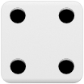
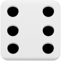
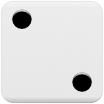
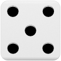
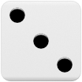


Yahtzee remains a timeless tabletop classic that blends probabilistic risk assessment with disciplined scorecard allocation.
Mastering the game requires balancing high-variance 50-point bonuses against the critical 35-point upper section threshold.

- **Accessible rules:** Playable with five dice, a cup, and a scorecard with zero barrier to entry for any age group.
- **The Upper Section bonus:** Prioritise scoring 63+ in the upper section to unlock the game-deciding 35-point bonus.
- **Risk management:** Use rerolls tactically and sacrifice low-value categories when dice rolls fail to materialise.
- **Enduring appeal:** Offers quick 20-minute rounds that combine strategic calculation with the thrill of dice rolling.


Few sounds in tabletop gaming are quite as satisfying as the clatter of five wooden or plastic dice tumbling out of a shaker cup onto a dining table.
Invented in the 1950s by an anonymous Canadian couple on their yacht and later acquired by game entrepreneur [Edwin S. Lowe](https://en.wikipedia.org/wiki/Edwin_S._Lowe), [Yahtzee](https://en.wikipedia.org/wiki/Yahtzee) remains one of the world's most enduring and accessible dice games.
Returning to this childhood favourite as an adult reveals just how much genuine tactical tension sits beneath its cheerful roll-and-write exterior.

While it is easy to dismiss Yahtzee as pure luck, experienced players know that the game is really an exercise in probability management and risk mitigation.
Every turn asks you to balance guaranteed modest gains against ambitious high-scoring combinations.
Whether you are introducing young players to dice mechanics or having a quick evening rematch, Yahtzee offers instant engagement without any rules bloat.

## What Is Yahtzee?

Yahtzee is a classic dice-rolling game for one or more players, played across 13 rounds using five six-sided dice and a specialised scorecard.
The objective is simple: accumulate the highest total score by filling each of the 13 categories on your scoresheet with the best possible combination.
Because each category can only be scored once per game, the choices you make in early rounds will directly dictate your risk tolerance in the endgame.

A typical game takes roughly 20 to 30 minutes, making it an ideal opener for game night or a relaxed family pastime.
The rules can be taught in under five minutes, yet the push-your-luck decisions keep everyone invested until the final dice roll.
If you enjoy other accessible tabletop classics like [Fungi]() or cooperative romps like [Mists Over Carcassonne](), Yahtzee delivers a delightfully retro change of pace.

## How A Turn Works

On your turn, you can roll the five dice up to three times to build the strongest scoring combination possible.
You do not have to use all three rolls if you are already satisfied with your result after the first or second attempt.

Follow these simple steps on each turn:

1. **First roll**: Place all five dice into the cup, shake, and roll them onto the table.
2. **Choose keepers**: Examine your roll and decide which dice you want to keep, setting them aside.
3. **Second and third rolls**: Re-roll any or all of the remaining dice to improve your combination.
4. **Score the result**: Select one unused category on your scoresheet and record your points.

You are never locked into the dice you set aside between rolls.
If you set aside two sixes after roll one but roll three fives on roll two, you can freely change strategy and re-roll the sixes on roll three.
Once your third roll is complete, however, you must enter a score in an open box on your scoresheet.

If your final roll cannot satisfy any remaining category on your scorecard, you must enter a **zero** (often called "scratching" a box) in one of your available slots.
Importantly, you can also voluntarily enter a zero in any open box even if your roll qualifies for points elsewhere.

This can be a shrewd tactical sacrifice.
For example, recording a single six for 6 points in your Sixes box could severely damage your chances of securing the 35-point Upper Section bonus.
In that situation, choosing to scratch an ambitious category like Yahtzee or Large Straight instead keeps your bonus pursuit alive.

## Scoring The Upper Section

The Yahtzee scorecard is split into two distinct halves: the Upper Section and the Lower Section.
The Upper Section focuses on collecting individual number values from ones through sixes.

When you score in the Upper Section, you sum only the dice that match the chosen category:

### Ones (aces)

You count and sum only the dice showing the number one.
All other dice are ignored.

    

In this example, your three ones score **3 points** in the Ones box.

### Twos

You count and sum only the dice showing the number two.

    

In this example, your four twos score **8 points** in the Twos box.

### Threes

You count and sum only the dice showing the number three.

    

In this example, your three threes score **9 points** in the Threes box.

### Fours

You count and sum only the dice showing the number four.

    

In this example, your three fours score **12 points** in the Fours box.

### Fives

You count and sum only the dice showing the number five.

    

In this example, your four fives score **20 points** in the Fives box.

### Sixes

You count and sum only the dice showing the number six.

    

In this example, your three sixes score **18 points** in the Sixes box.

### The all-important 35-point upper section bonus

The real secret to winning Yahtzee lies in the Upper Section bonus.
If your combined score across Ones, Twos, Threes, Fours, Fives, and Sixes reaches **63 points or higher**, you receive a massive **35 bonus points**.

The target number 63 is not arbitrary: it represents rolling exactly three of each number:

- Three 1s = 3
- Three 2s = 6
- Three 3s = 9
- Three 4s = 12
- Three 5s = 15
- Three 6s = 18
- **Total: 63 points** (giving 98 points after the 35-point bonus is applied)

If you fall short on lower numbers like Ones or Twos, you can make up the deficit by rolling four of a kind on Fives or Sixes.
Securing this bonus provides a commanding scoring cushion that often decides the winner.

## Scoring The Lower Section

The Lower Section contains poker-style combinations that award either the sum of all dice or a substantial fixed point bounty.
Understanding the specific criteria for each box helps you pivot when an intended roll goes awry.

### Three of a kind

You must have at least three dice showing the same number.
Your score is the **sum of all five dice**, not just the matching trio.

    

In this example, three fours combined with a two and a six give you **20 points** (4 + 4 + 4 + 2 + 6).
Because all five dice contribute to your total, if you have rolls remaining and your non-matching dice show a three or lower, consider re-rolling just those low dice to try to increase your overall score.

### Four of a kind

You must have at least four dice showing the same number.
Like three of a kind, your score is the **sum of all five dice**.

    

In this example, four fives and a three give you **23 points** (5 + 5 + 5 + 5 + 3).
If your unmatched die is a three or lower and you still have a roll left, re-rolling that single die carries zero risk to your combination while giving you a chance at a higher score or even a Yahtzee.

### Full house

A Full House requires three dice of one number and two dice of another number.
This combination always awards a flat **25 points**, regardless of the face values rolled.

    

Three threes and two sixes fulfil the condition perfectly, earning you **25 points**.
Because the payout is fixed at 25 points, there is no benefit to continuing to roll if you already have the three of a kind and the pair.
Stopping immediately secures your 25 points without risking the combination.

### Small straight

A Small Straight consists of any sequence of four consecutive numbers.
The fifth die can be any value and does not need to connect to the sequence.
A Small Straight scores a fixed **30 points**.

Valid four-number sequences include `1-2-3-4`, `2-3-4-5`, and `3-4-5-6`.
Even if all five dice form a complete five-number straight, you can still score it in your Small Straight box if your Large Straight category is already occupied.

    

Here, the sequence `1-2-3-4` is present alongside an extra six, securing **30 points**.

### Large straight

A Large Straight requires a complete five-number sequence.
This is significantly harder to roll, which is why it awards a generous fixed **40 points**.

There are only two possible combinations that satisfy this category: `1-2-3-4-5` or `2-3-4-5-6`.

    

Rolling `2-3-4-5-6` completes the sequence and banks **40 points**.

### Yahtzee (five of a kind)

The pinnacle roll of the game occurs when all five dice show identical faces.
A successful Yahtzee scores **50 points**.

    

Five sixes earns the coveted **50 points** in the Yahtzee box.

If you are fortunate enough to roll an additional Yahtzee after already scoring 50 in your Yahtzee box, you receive a massive **100 extra bonus points** for each subsequent five of a kind.
Under official rules, these 100 bonus points are awarded in addition to your regular turn, allowing you to use the roll as a "Joker" to claim full points in another open category (such as 25 for a Full House or 40 for a Large Straight).
It is a frankly overpowered rule that almost guarantees victory through pure luck, which is why many families deliberately ignore it in favour of simpler house rules.

### Chance

Chance is your ultimate safety valve.
There are no requirements or matching conditions: your score is simply the **sum of all five dice**.

    

When an ambitious roll fails to complete a straight or full house, dumping high dice into Chance ensures you still score respectable points (in this case, **24 points**).

## Tactical Tips For Higher Scores

While dice rolls are inherently random, your long-term success comes down to solid decision making:

- **Prioritise the Upper Section early**: Aiming for three or four of a kind on Fours, Fives, and Sixes gives you a healthy lead towards the 35-point bonus.
- **Never waste high rolls on low categories**: If you roll four sixes, putting them in Sixes (24 points) is almost always wiser than taking Four of a Kind (24+ points), because it virtually guarantees your Upper Section bonus.
- **Protect your Chance box**: Do not burn your Chance box on a low-scoring roll of 12 or 14 points early in the game; save it for high-value misses later on.
- **Know when to sacrifice Ones**: If you find yourself needing to scratch a category, sacrificing the Ones box costs you at most 3 or 4 points, whereas scratching a 40-point Large Straight or 50-point Yahtzee is far more damaging.
- **Pivot on straights**: If you hold `2-3-4` after roll one, you have two chances to hit either a `1` or a `5` on both ends to complete a Small Straight.

## Understanding The Probabilities

Knowing the mathematical odds behind each category transforms how you evaluate your rolls.
Because five six-sided dice produce 7,776 distinct outcomes on any single roll, some combinations are substantially rarer than they might appear.

Here is how the combinations stack up on a single five-dice throw:

| Combination | Winning Outcomes (out of 7,776) | Single-Roll Probability | Approximate Odds |
| :--- | :---: | :---: | :---: |
| **Three of a kind (or better)** | 1,656 | 21.30% | 1 in 4.7 |
| **Small straight** | 1,200 | 15.43% | 1 in 6.5 |
| **Full house** | 300 | 3.86% | 1 in 26 |
| **Large straight** | 240 | 3.09% | 1 in 32 |
| **Four of a kind (or better)** | 156 | 2.01% | 1 in 50 |
| **Yahtzee (five of a kind)** | 6 | 0.08% | 1 in 1,296 |

### How re-rolling transforms the odds

While the table above reflects the pure odds of a single roll, the power in Yahtzee comes from your ability to hold keepers and re-roll up to two more times.
This three-roll mechanism shifts the mathematics heavily in your favour when you actively target a combination.

The most dramatic difference is seen when chasing a Yahtzee:

- **Single throw**: Rolling a natural Yahtzee straight out of the cup is a minuscule **0.08%** chance (1 in 1,296).
- **Across three rolls**: If you roll a pair or triple on roll one and hold matching dice on subsequent rolls, your probability of completing a Yahtzee on that turn leaps to roughly **4.6%** (about 1 in 22 turns).
- **Across a 13-round game**: If you actively push for a Yahtzee whenever you roll early matching dice, your probability of landing at least one Yahtzee across an entire game rises to roughly **33%** (about 1 in 3 games).

### Practical probability takeaways

These numbers explain several important tactical realities:

- **Large Straights are rarer than Full Houses**: A Large Straight is statistically harder to roll naturally (3.09%) than a Full House (3.86%), which explains why the game awards 40 points for the straight versus 25 for the house. Over three rolls, a targeted Large Straight succeeds about 26% of the time.
- **Small Straights are five times easier**: You have a 15.43% chance of landing a Small Straight on roll one compared to just 3.09% for a Large Straight. Across three rolls, a Small Straight succeeds more than 60% of the time, making it a dependable fallback.
- **Re-rolls reward focused commitment**: When you commit to a strategy on roll one and hold matching dice, subsequent rolls compound your chances significantly, making disciplined target selection the key to consistent winning.

## Wrapping Up

Revisiting Yahtzee reminded me why this game has remained a household staple for more than seven decades.
It captures that quintessential push-your-luck excitement where every roll presents a genuine choice between safety and glory.
The satisfaction of rolling a natural five of a kind or executing a clutch sequence to claim the 35-point bonus never gets old.

If you have a set sitting in the back of your cupboard, dust it off for your next casual session.
For more tabletop recommendations and tactical guides, take a look at my reviews for [Fungi]() and [Regicide]().
Grab your dice cup, roll with confidence, and enjoy the thrill of the chase!
