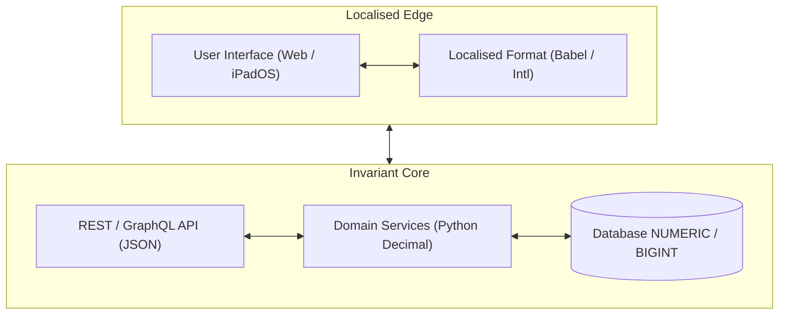

At first glance, numbers appear to be the simplest data type in computer science.
Unlike natural languages with irregular grammar and complex idioms, numbers feel purely mathematical, universal, and unambiguous.
You collect a string of digits from an input field, pass it to your language's standard casting function, and store the result in your database.

If you deploy software to users around the world, this naive simplicity quickly shatters.
Punctuation marks that seem self-evident in one country completely invert their meaning in another.
Assumptions about digit grouping, non-Latin numeral scripts, and sign placement introduce silent data corruption across pipelines and interfaces.

In this guide, I examine the unexpected pitfalls of parsing and formatting numbers.
This article forms part of my [Software Pitfalls]() series, continuing from [Never Roll Your Own Date Maths]() and [Handling Currency Calculations]().
I'll show you where numeric parsing fails, how tabular CSV imports break, and how to design robust user experiences across modern touch interfaces.

## The Great Separator Divide

The most frequent source of number corruption stems from two innocent punctuation marks: the period (`.`) and the comma (`,`).

In English-speaking nations, the period acts as the radix point (the decimal separator) and the comma serves as the thousands grouping separator.
In continental Europe, South America, and parts of Africa, those roles are completely reversed.
A price tag of `1,234` means one thousand two hundred and thirty-four in London, but one point two three four in Berlin.

The ambiguity worsens when you look beyond Western Europe.
Switzerland frequently uses an apostrophe for thousands grouping, rendering figures like `1'000.00` or `1'000,00`.
Arabic locales use distinct typographical marks altogether: the *momayyez* (`٫`, `U+066B`) as a decimal separator and the Arabic thousands separator (`٬`, `U+066C`).

In many other countries, the grouping separator is not punctuation at all.
French, Russian, and Scandinavian locales use spaces to separate digit clusters (such as `1 234,56`).
International scientific standards (including ISO 80000-1 and the BIPM) formally mandate spaces instead of commas or dots to eliminate international confusion.

In software, these numbers rarely use an ordinary ASCII space (`U+0020`), which could allow a line break to orphan trailing digits across two lines.
Instead, modern typesetting engines insert a non-breaking space (`U+00A0`) or a narrow non-breaking space (`U+202F`) inside figures like `1 000,50`.
If your data ingestion pipeline splits tokens on standard ASCII whitespace or uses naive regexes, these hidden Unicode space characters cause parsing to fail silently.

When you combine multiple locales inside a single application, naive string parsing cannot reliably guess user intent.
If a German customer enters `50.000` expecting fifty thousand euros, an Anglo-centric parser treats the period as a decimal point and evaluates the input as fifty.
If they enter `12,50` for twelve euros and fifty cents, a naive parser stripping commas produces `1250`, overcharging their card by a factor of one hundred.

## Beyond Groups of Three: Irregular Grouping

Most Western developers assume that digit grouping always follows a rigid rule of three.
You place a separator every three digits to the left of the decimal point: thousands, millions, billions.

This assumption fails in South Asian numbering systems, used across India, Pakistan, Bangladesh, and Nepal.
The Indian numbering system groups the first three digits, but subsequent digits are clustered in pairs.
This corresponds to traditional units called the *lakh* (one hundred thousand, or `1,00,000`) and the *crore* (ten million, or `1,00,00,000`).

```python
from babel.numbers import format_decimal

amount = 12345678.90

# Standard Western grouping (groups of three):
en_uk = format_decimal(amount, locale="en_GB")
print(en_uk)
# Output: 12,345,678.9

# Indian numbering system (3 digits, then groups of 2):
en_in = format_decimal(amount, locale="en_IN")
print(en_in)
# Output: 1,23,45,678.9
```

If you hard-code regular expressions or string formatters that enforce three-digit grouping, you break standard financial representations for over a billion people.
A financial dashboard displaying `12,345,678.90` instead of `1,23,45,678.90` feels jarring and disorienting to an Indian accountant.

Similarly, traditional Chinese and Japanese numerals group numbers by myriad units (powers of 10,000, or 万).
While modern business in Japan and China commonly adopts Western three-digit grouping for Arabic numerals, cultural expectations still surface in localised speech, reports, and UI layouts.

## Unicode and Numeral Scripts

Not all numbers consist of standard ASCII digits (`0` through `9`).
Across different regions and operating systems, users enter numbers using diverse Unicode scripts.

### Non-Latin scripts and full-width digits

In many regions, native scripts replace Latin digits entirely, such as Eastern Arabic-Indic (`٠١٢٣٤٥٦٧٨٩`) or Devanagari (`०१२३४५६७८९`).
Similarly, East Asian operating systems frequently generate full-width characters (`１２３４`, `U+FF11` through `U+FF19`).

If your database or backend logic expects pure ASCII digits, direct inputs from these keyboards will fail validation.
Worse, standard regex character classes behave unpredictably across languages:

```python
import re

# In Python 3, \d matches all Unicode decimal digits by default:
arabic_digits = "١٢٣٤٥"
print(bool(re.match(r"^\d+$", arabic_digits)))
# Output: True

# However, standard ASCII ranges reject them:
print(bool(re.match(r"^[0-9]+$", arabic_digits)))
# Output: False
```

While Python's built-in `int()` and `float()` parse Unicode digits natively, downstream SQL drivers and foreign function interfaces often reject them.
To prevent mysterious validation failures, always normalise incoming text using `unicodedata.normalize('NFKC', text)` before processing.

### Minus signs and negative representations

Negative numbers present their own surprises.
Developers assume a minus sign is always the standard ASCII hyphen (`-`, `U+002D`).

In practice, typography and locales introduce several variations:

- The true mathematical Unicode minus sign (`−`, `U+2212`), which matches the width and stroke of a plus sign.
- Accounting parenthesis formatting: `(1,234.50)`, where brackets designate negative balances without any minus symbol.
- Trailing negative signs: In legacy mainframe exports and certain locales (such as parts of Scandinavia or Arabic scripts), the sign appears at the end: `1 234,50-`.

If your parsing routines search exclusively for a leading ASCII hyphen, negative transactions will either raise parsing exceptions or silently convert into positive quantities.

## The CSV and Tabular Data Nightmare

The collision between decimal separators and data interchange formats is most visible when importing tabular data, especially CSV files.

The CSV (Comma-Separated Values) specification assumes commas separate columns.
What happens when you generate or consume a CSV in a country where the comma is the decimal mark?

### The semicolon delimiter shift

In countries like Germany, France, and Spain, desktop spreadsheet applications (like Microsoft Excel) refuse to create comma-delimited files.
Because numbers already contain commas (`24,50`), using commas as delimiters would break every single row.

Instead, regional versions of Excel automatically export CSV files using semicolons (`;`) as column delimiters.
When an English-configured service parses this file with a default comma delimiter, each line is treated as a single undivided string column, immediately causing indexing errors.

### Cross-locale spreadsheet corruption

The problem escalates when colleagues across different offices exchange files.
Consider this common corporate scenario:

1. A developer in London exports an account ledger with standard CSV commas: `"Widget A",10,1234.56`.
2. A colleague in Frankfurt opens the file by double-clicking it in German Excel.
3. German Excel does not recognise `1234.56` as a number because the decimal point is a dot; it imports the value as a raw text string.
4. The German user edits another column, clicks "Save", and Excel exports the file using semicolons and German formatting: `"Widget A";10;1234,56`.
5. The automated backend pipeline in London crashes because its parser expects commas and dots.

To handle tabular data reliably, your import pipelines should inspect files dynamically using `csv.Sniffer` to detect delimiters, while parsing numeric columns with locale awareness.

```python
import csv
from io import StringIO
from babel.numbers import parse_decimal

csv_data = "Produkt;Menge;Preis\nLaptop;2;1.199,50"

# Detect delimiter automatically
dialect = csv.Sniffer().sniff(csv_data.splitlines()[0])
reader = csv.DictReader(StringIO(csv_data), dialect=dialect)

for row in reader:
    # Parse German decimal format cleanly into a Decimal object:
    price = parse_decimal(row["Preis"], locale="de_DE")
    print(f"Parsed price: {price} (Type: {type(price).__name__})")

# Output:
# Parsed price: 1199.50 (Type: Decimal)
```

## UX Patterns for Rich Number Inputs

Handling numbers in software is not merely a backend parsing challenge; it is fundamentally a user experience challenge.
Your goal is to present clear, culturally familiar numbers to users without introducing friction or ambiguity during data entry.

On rich interfaces (such as web dashboards, mobile apps, and tablet forms on iPadOS), you must resolve an inherent tension:
users want to read formatted numbers with grouping separators, but typing through grouping separators is frustrating.

### The dual-representation principle

To keep your application robust, separate your presentation model from your underlying domain state:

1. **Storage state (Invariant):** Store all numbers internally in an invariant canonical format (such as an exact `Decimal` or pure unadorned string `1234.50`).
2. **Display state (Localised):** Format numbers according to the user's active locale when rendering text, labels, and read-only tables.

When an interface allows user editing, you have two primary design patterns to choose from.

### Pattern 1: Format on blur, unformat on focus

This pattern is the cleanest and least error-prone approach for both web applications and touch interfaces like iPadOS.

When the input field is inactive, display the number in its full, localised glory (such as `1,234.50` or `1.234,50`).
The moment the user focuses or taps inside the field, strip the thousands grouping separators, displaying the raw numeric value (`1234.50` or `1234,50`).

```text
Display state (Inactive / Blurred):
[  £ 1,234.50  ]

Editing state (Active / Focused):
[  1234.50     ]
```

This approach provides immediate benefits:

- On iPadOS and iOS devices, focusing the field opens the numeric keypad without forcing the user to navigate around auto-inserted commas.
- It prevents cursor jumps.
  When a script attempts to insert grouping commas while a user is typing, the cursor often jumps awkwardly to the end of the line.
- When the user finishes editing and moves to the next field (blur event), your validation parses the input and reformats it with pretty grouping.

### Pattern 2: Locale-aware parsing with established libraries

When users paste or type formatted numbers, developers often attempt to write bespoke sanitisation routines.
You might be tempted to strip spaces, count commas and dots, or assume the last separator is always the decimal mark.

Resist this urge completely.
Just as with date arithmetic and timezone calculations, rolling your own number parser is an invitation to production bugs.
Custom regexes and string splitting routines inevitably break down when confronted with Swiss apostrophes, French narrow non-breaking spaces, or South Asian grouping.

Instead, always delegate parsing to established internationalisation libraries backed by the Unicode Common Locale Data Repository (CLDR).
In Python, the standard tool for locale-aware number parsing is `Babel`:

```python
from babel.numbers import parse_decimal, NumberFormatError
from decimal import Decimal

def safe_parse_user_number(raw_input: str, user_locale: str) -> Decimal:
    """Parses a user-entered number using their specific locale conventions."""
    try:
        # Babel handles locale-specific decimal marks, grouping, and non-breaking spaces
        return parse_decimal(raw_input.strip(), locale=user_locale)
    except NumberFormatError as exc:
        # Never guess when user intent is ambiguous; prompt for clean entry instead
        raise ValueError(f"Invalid number format for locale {user_locale}") from exc

# A British user enters standard comma-grouped input:
print(safe_parse_user_number("1,234.50", "en_GB"))
# Output: 1234.50

# A German user enters standard dot-grouped input:
print(safe_parse_user_number("1.234,50", "de_DE"))
# Output: 1234.50

# A French user pastes figures with a narrow non-breaking space (U+202F):
print(safe_parse_user_number("1\u202f234,50", "fr_FR"))
# Output: 1234.50
```

By leveraging `parse_decimal`, you let the library verify that the grouping separators and decimal marks match the user's cultural expectations.
If a German user inadvertently pastes an ambiguous English-formatted number into a German-configured form, `Babel` raises a `NumberFormatError`.
This allows your UI to highlight the field and ask the user for confirmation, rather than silently corrupting the value.

## Architectural Boundaries: Invariant Core vs Localised Edge

To prevent number formatting bugs from cascading across your architecture, establish a strict boundary between internal systems and presentation layers.



### The invariant core

Everything behind your presentation layer must be strictly invariant:

- **JSON APIs:** Numeric fields in JSON payloads must always use standard ASCII digits and a period decimal point (`1234.56`), or integer minor units.
  Never transmit localised strings like `1.234,56` across internal API endpoints.
- **Databases:** Persist numbers using native `NUMERIC`/`DECIMAL` types or integers.
  Never store formatted strings containing commas or spaces in database columns.
- **Log files and metrics:** Ensure logs output invariant numbers so your analytics and observability tools can parse and graph metrics without locale conflicts.

### The localised edge

Culture-aware parsing and formatting should occur solely at the boundary where your software interacts with humans:

- In Python backends, use established libraries like `Babel` or `PyICU` to parse incoming user strings and format outbound displays.
- In web frontends, rely on the native browser `Intl.NumberFormat` API, which respects the operating system and browser locale without requiring third-party JavaScript bundles.

By keeping your core logic invariant and pushing localisation to the edge, you ensure that internal calculations remain rock-solid while your users enjoy a tailored, native experience.

## Wrapping Up

Numbers are not culturally neutral.
What appears to be universal mathematical notation is actually a collection of regional conventions, typography rules, and historical compromises.

When you design software that accepts, processes, or displays numbers, keep these essential practices in mind:

- Never assume a period is a decimal mark or a comma is a thousands separator; verify the user's locale.
- Remember that grouping does not always occur in threes, as demonstrated by the South Asian Lakh and Crore systems.
- Normalise Unicode input to handle full-width characters, non-Latin numeral scripts, and typography minus signs.
- Expect European tabular data and CSV files to use semicolons as delimiters and commas as decimals.
- Adopt the "format on blur, unformat on focus" UX pattern for rich text fields and mobile touch screens.
- Never roll your own parsing heuristics; rely on established internationalisation libraries like Babel backed by the Unicode CLDR.
- Keep your internal architecture invariant: store and transmit numbers using canonical representations, reserving localisation strictly for the user-facing edge.

Have you ever had a billing pipeline fail or a spreadsheet import corrupt data because of a misplaced comma?
Take time to review your application's input parsers, and ensure your numbers are as robust as your business logic.
